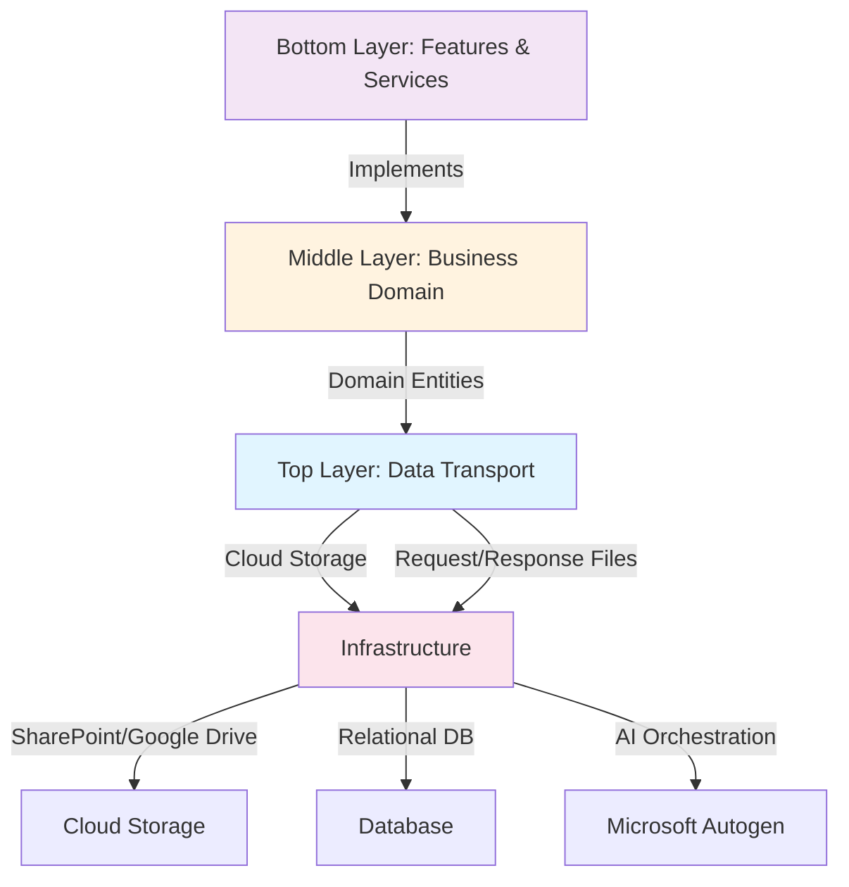
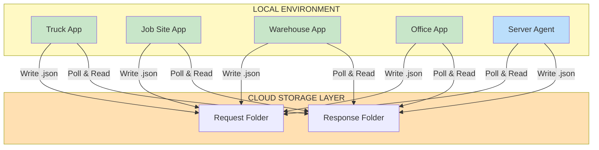
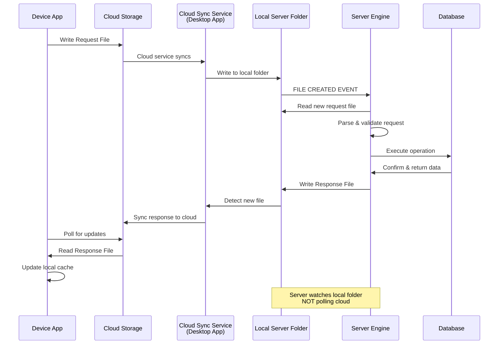
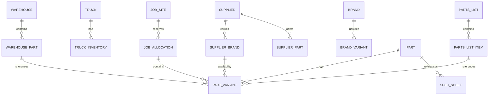
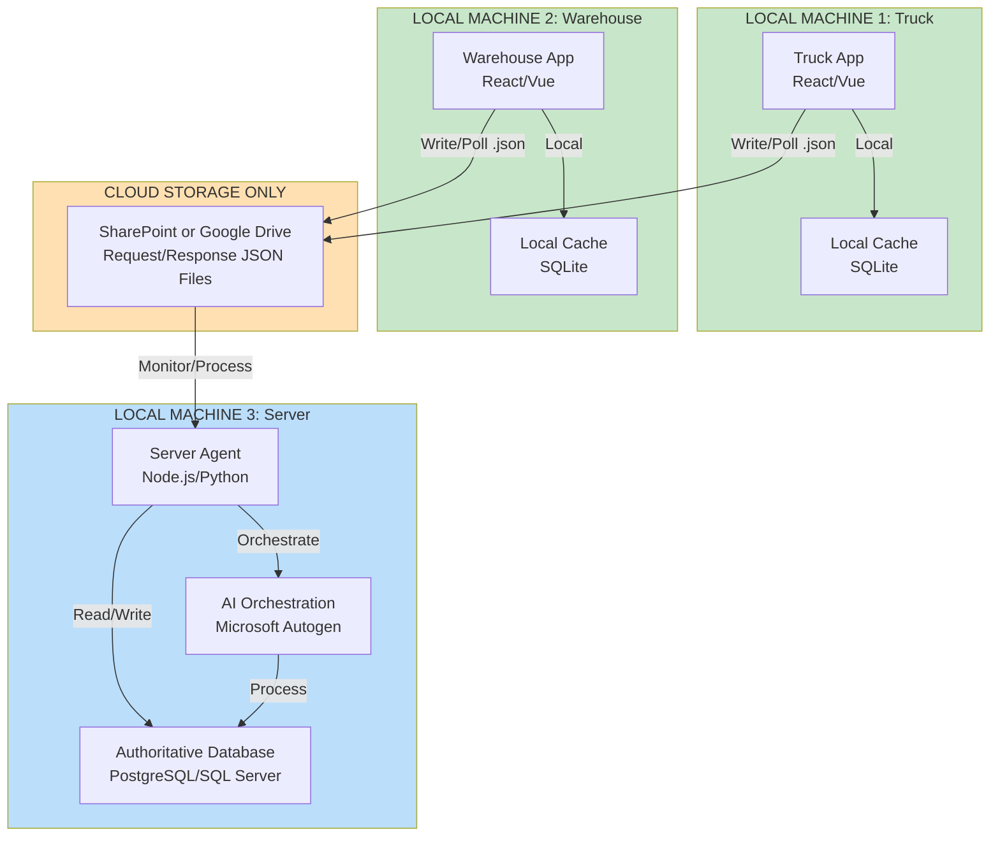
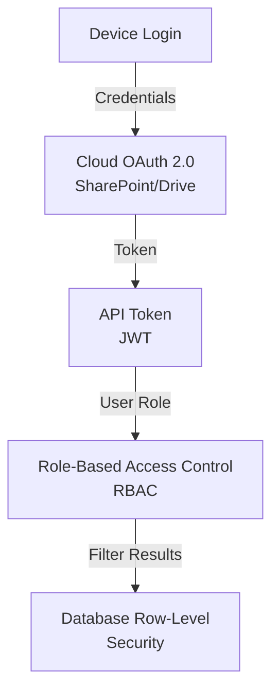
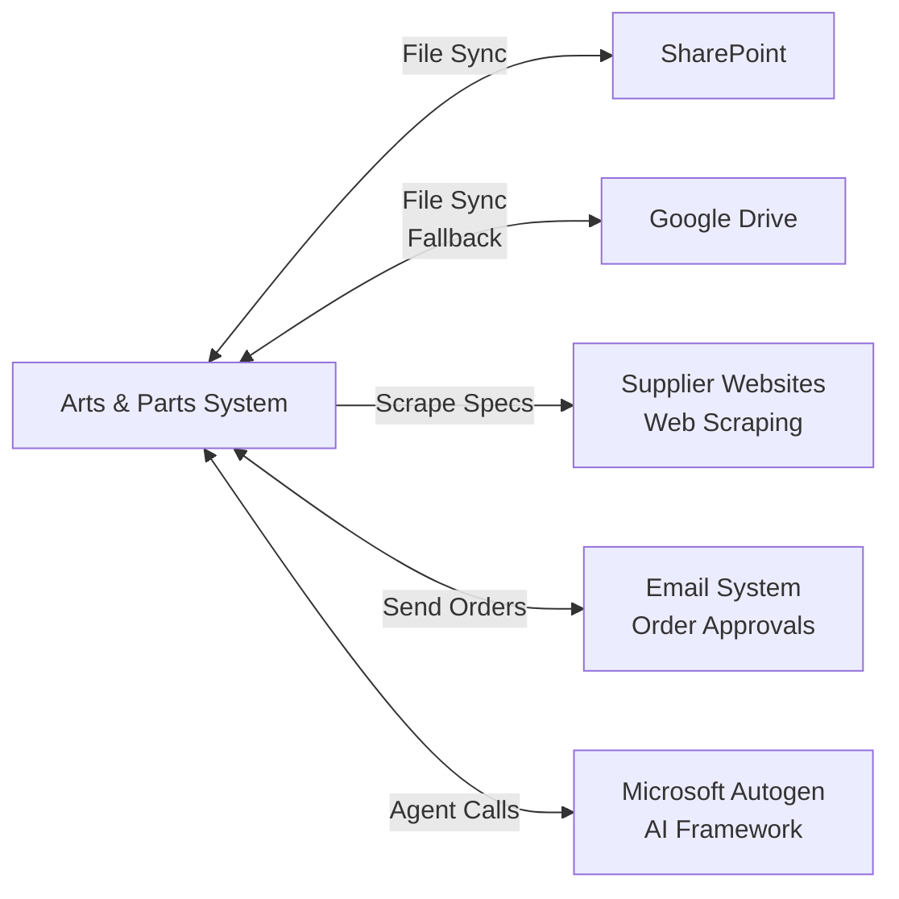

# WeirdToo Parts System – System Architecture Document

## 1. Overview

The WeirdToo Parts System is a server-controlled, cloud-mediated inventory and logistics platform designed for managing parts across multiple warehouses, trucks, job sites, and suppliers. The architecture emphasizes **auditability**, **modularity**, and **security** through a strict separation of concerns across four distinct layers.

### Core Principles

- **Local-First Architecture**: All devices and server run on local machines; NO direct internet communication between apps
- **Cloud Storage as Sole Messenger**: SharePoint/Google Drive is the ONLY communication conduit between devices and server
- **File-Based Protocol Only**: Devices communicate via JSON request/response files in cloud folders; NO HTTP/REST/WebSocket between apps
- **Server-Controlled Database**: Only the server modifies the authoritative database; all devices request changes via cloud files
- **Stateless Devices**: Devices are offline-capable; they cache data locally and sync asynchronously when cloud access available
- **Auditability**: All changes logged via cloud files; modification chains permanently tracked
- **Modularity**: Each component (truck app, warehouse app, server) can operate independently

---

## 2. System Architecture Overview

### Three-Layer Architecture Model



---

## 2.1 Critical Design: Local-Only with Cloud File I/O

### No Direct Internet Communication Between Apps

This system is explicitly designed for **LOCAL MACHINES ONLY** with cloud storage as the ONLY inter-app communication mechanism:



### ❌ Explicitly Prohibited

- Device HTTP/REST calls to server
- Direct TCP/UDP sockets between machines
- WebSocket connections between apps
- gRPC calls between devices
- Direct database connections from devices
- Any network communication except through cloud storage APIs

### ✅ Only Allowed Communication

- Devices write JSON files to cloud folders
- Cloud service (SharePoint/Google Drive desktop sync) syncs files to/from cloud
- Devices poll cloud folders for responses
- Server watches local synced folders for NEW FILE events (not polling cloud)
- Server writes response files to local folder (cloud service syncs back automatically)
- Local databases on each machine
- Local caching and offline operation

### Implications for System Design

| Aspect | Impact |
|--------|--------|
| **Network Dependency** | System fully functional offline; syncs when cloud available |
| **Latency** | 10-60 second delays (polling intervals); NOT real-time |
| **Scalability** | Limited by cloud storage I/O speed; designed for small-medium teams |
| **Simplicity** | No firewalls, port forwarding, API keys, or complex networking |
| **Security** | No exposed network APIs; communication via authenticated cloud storage |
| **Offline First** | Devices continue working offline; sync on next cloud connection |
| **Deployment** | Each machine runs standalone; needs only cloud storage access |

---

## 3. Layer 1: Top Layer – Data Transport

**Purpose**: Manage data flow between devices and server via cloud storage files

### Components

| Component | Responsibility |
|-----------|-----------------|
| **Device Applications** | Mobile/Desktop apps on trucks, job sites, warehouse, office |
| **Cloud Filing System** | SharePoint (primary) or Google Drive (secondary) |
| **Cloud Request Files** | JSON/XML files containing device requests |
| **Cloud Response Files** | Server responses synced back to devices |
| **Request Queue** | Logical queue of pending requests awaiting server processing |

### Data Flow Pattern



### Cloud File Structure

**Request File Example Path**: `/requests/devices/{device_id}/{timestamp}_request.json`

```json
{
  "requestId": "uuid",
  "deviceId": "truck_001",
  "timestamp": "2025-12-21T14:30:00Z",
  "operationType": "FETCH_INVENTORY|SUBMIT_PARTS_LIST|UPDATE_TRUCK_LOAD|CREATE_RETURN",
  "payload": {},
  "status": "PENDING|PROCESSING|COMPLETED|FAILED",
  "serverId": null
}
```

**Response File Example Path**: `/responses/devices/{device_id}/{timestamp}_response.json`

---

## 4. Layer 2: Middle Layer – Business Domain

**Purpose**: Define core business entities and their relationships

### Domain Entities

#### Warehouses
- Multiple warehouses supported
- Target inventory levels per item per warehouse
- Supplier assignment per warehouse (with cross-supplier options)
- Threshold-based alerts

#### Trucks
- Individual truck ID and capacity
- Current inventory (subset of warehouse stock)
- Assigned jobs (active deliveries)
- Load manifests synchronized with warehouse
- Optional target inventory levels

#### Job Sites
- Location tracking
- Parts delivered and allocated to job
- Parts consumed/used on job
- Optional drop-site inventory (delivered but not yet on-site)
- Return logs with supplier source tracking
- Consumption logs per job

#### Suppliers
- Supplier profiles with delivery schedules
- Lead times by brand/category
- Brand coverage (which brands does supplier stock?)
- Pricing data per brand/part
- Contact and ordering information

#### Parts & Inventory
- Hierarchical categorization (Pipes, Outlets, Switches, Wire, etc.)
- Measurement units (Count vs. Linear Feet vs. custom)
- Multiple variants per part (wire: 250ft/roll, 1000ft/roll)
- Brand variants (switches: Decora, Programmable, Smart, Hybrid)
- SKU/part number mapping
- Spec sheet attachments/references

### Entity Relationships



---

## 5. Layer 3: Bottom Layer – Features & Services

**Purpose**: Implement user-facing features and system services

### Feature Categories

#### Inventory Management
- Real-time stock tracking across warehouses, trucks, job sites
- Target level monitoring and threshold alerts
- Return processing with supplier source tracking
- Multi-warehouse stock consolidation

#### Parts List Management
- Draft creation by account staff (private to staff)
- Supervisor review and modification (with change logging)
- AI-driven approval and item-by-item analysis
- Determination of shop stock vs. required orders
- Integration with supplier ordering

#### Supplier Order Management
- Automated order compilation consolidating multiple jobs
- Supplier-brand matching and availability checking
- Order generation with SKU variants
- Manual email export for office approval
- Delivery tracking and receipt confirmation

#### Chat & Communication
- General team chat
- Direct messaging
- Item/part tagging with mentions
- AI Q&A channel for direct questions
- Smart suggestion for auto-tagging item creators

#### AI & Automation Services
- Multi-level AI team (Planners, Orchestrators, Agents)
- Event-driven triggers (cloud file creation)
- Time-driven triggers (supplier schedule monitoring)
- Research-driven triggers (web scraping supplier specs/brands)
- Master task queue with subtask dependency blocking
- Quality assurance verification loops

#### User Interface Modules
- Truck Inventory Panel
- Job Management Dashboard
- Warehouse Stock View
- Parts List Editor with AI recommendations
- Chat/notification center
- Supplier order approval workflow

---

## 6. Infrastructure & Deployment

### Deployment Architecture: Local Machines Only



### Technology Stack Per Machine

**Device Machines (Truck, Warehouse, Office, Job Site)**
- **Frontend**: React or Vue.js
- **Local Database**: SQLite (caching, offline operation)
- **Cloud I/O**: Cloud SDK (SharePoint or Google Drive API)
- **NO API Server**: Apps communicate with cloud storage only

**Server Machine**
- **Backend Agent**: Node.js (Express) or Python (FastAPI)
- **Server Database**: PostgreSQL 14+ or SQL Server 2019+ (source of truth)
- **Cache Layer**: Redis (optional; internal server optimization)
- **AI Framework**: Microsoft Autogen (Python-based)
- **Cloud I/O**: Cloud SDK for monitoring request folders

**Shared: Cloud Storage**
- **Primary**: Microsoft SharePoint
- **Fallback**: Google Drive
- **Purpose**: File-based message queue for all inter-app communication

### Critical: NO API Gateway, NO Network Services

- **No HTTP API listening on ports** (no device-to-server API calls)
- **No REST endpoints exposed to devices**
- **No service discovery or load balancing**
- **No message brokers or event streaming**
- **Cloud storage IS the message broker**

---

## 7. Component Interaction Matrix

Shows which components communicate with which:

| Component | Devices | Cloud | Server | Database | AI | Chat |
|-----------|---------|-------|--------|----------|----|----|
| **Devices** | - | RW | - | - | - | W |
| **Cloud** | RW | - | RW | - | RW | - |
| **Server** | - | RW | - | RW | RW | RW |
| **Database** | - | - | RW | - | R | R |
| **AI** | - | RW | RW | R | - | RW |
| **Chat** | R | - | RW | RW | W | - |

**RW** = Read/Write | **R** = Read | **W** = Write

---

## 8. Data Security Architecture

### Authentication & Authorization



### Access Control by Role

- **Account Staff**: Create parts lists, view warehouse/truck inventory
- **Supervisors**: Review and modify parts lists, approve consolidations
- **Office Staff**: Approve supplier orders, track deliveries
- **Warehouse**: Manage stock levels, process shipments
- **Truck Drivers**: View assigned jobs, update inventory, log consumption
- **System Admin**: Configure suppliers, brands, categories, thresholds

### User Role Hierarchy & Permissions

**Tree-Based Role Structure**:

The system uses a fully customizable tree hierarchy where each role can have child roles. Roles are organized by level (0=Admin, 1=Manager, 2=Supervisor, 3=Worker, etc.) with configurable permissions at each level.

**Example Role Tree**:
```
Level 0 (Admin)
├── Level 1 (Project Manager)
│   ├── Level 2 (Site Supervisor - Commercial)
│   │   └── Level 3 (Worker - Commercial)
│   └── Level 2 (Site Supervisor - Residential)
│       └── Level 3 (Worker - Residential)
└── Level 1 (Warehouse Manager)
    └── Level 2 (Warehouse Worker)
```

**Configurable Role Permissions** (Checkboxes per Role):
- `can_edit_same_level`: Allow editing users at same hierarchy level
- `can_edit_different_tree`: Allow editing users in different tree branches
- `can_edit_subordinates`: Allow editing direct reports (default: true)
- `requires_approval`: User requests require approval
- `can_approve_subordinate_requests`: Can approve requests from lower levels
- `approval_threshold_amount`: Maximum $ value before escalation required
- `can_create_users`: Permission to create new user accounts
- `can_delete_users`: Permission to delete user accounts
- `can_manage_roles`: Permission to modify role structure
- `can_view_all_inventory`: See inventory across all departments
- `can_edit_all_inventory`: Modify inventory across all departments

### Edit Permission Decision Matrix

| Scenario | Requester | Target | Permission | Approval Required | Notes |
|----------|-----------|--------|------------|-------------------|-------|
| 1 | Admin (L0) | Anyone | ALWAYS | Configurable | Admin override |
| 2 | Manager (L1) | Subordinate (L2/L3) same tree | ALWAYS | Configurable | Direct hierarchy |
| 3 | Manager (L1) | Different tree (any level) | CONFIGURABLE | Yes | Requires `can_edit_different_tree=true` |
| 4 | Supervisor (L2) | Same level (L2) same tree | CONFIGURABLE | Yes | Requires `can_edit_same_level=true` |
| 5 | Supervisor (L2) | Worker (L3) own tree | ALWAYS | Configurable | Direct subordinate |
| 6 | Supervisor (L2) | Different tree Supervisor (L2) | CONFIGURABLE | Yes | Requires `can_edit_different_tree=true` |
| 7 | Worker (L3) | Anyone | NEVER | N/A | No edit permissions unless exception granted |
| 8 | Any role | Higher level | NEVER | N/A | Cannot edit upward in hierarchy |
| 9 | Exception list | Specific user | ALWAYS | Configurable | Manual exception grant with optional expiration |

**Permission Logic Flow**:
1. Check if admin override (can_manage_roles) → Grant access
2. Check exception list → Grant if exception exists and active
3. Prevent upward edits (target role level < requester role level) → Deny
4. Check tree relationship (same tree vs different tree)
5. Apply role-specific permissions (can_edit_same_level, can_edit_different_tree)
6. Determine approval requirement based on `requires_approval` setting

### Department Structure

**Four Primary Department Types**:
- **Office**: Administrative, management, accounting roles
- **Warehouse**: Inventory management, receiving, shipping
- **Truck**: Mobile workers, delivery personnel, service technicians
- **Job Site**: Active construction site workers, supervisors

**Multi-Department Assignment**:
Users can be assigned to multiple departments with one marked as primary. This supports scenarios where supervisors manage both warehouse and job site operations, or managers oversee multiple locations.

**Department Visibility Rules**:
- Users see inventory from all assigned departments
- Requests default to user's primary department
- Approvers notified based on their department assignments
- Reports can filter by department for analysis

### Data Protection

- **Encryption in Transit**: TLS 1.2+ for all API calls
- **Encryption at Rest**: Database encryption, cloud storage encryption
- **Audit Logging**: All database modifications logged with user/timestamp
- **Cloud File Permissions**: Device read/write limited to own device ID prefix

---

## 9. Scalability Considerations

### Horizontal Scaling

- **Stateless API Services**: Multiple instances can process requests
- **Cloud File Queue**: Natural load balancing as server processes requests in order
- **Database**: Read replicas for query-heavy operations, connection pooling

### Performance Optimization

- **Caching**: Frequently accessed parts, suppliers, brands cached in Redis
- **Async Processing**: Long-running AI tasks processed asynchronously
- **Cloud File Batching**: Server processes requests in batches to reduce I/O
- **Device Sync**: Configurable polling intervals to reduce cloud API calls

---

## 10. System Boundaries & External Integrations

### External Systems



### Integration Points

1. **Cloud Storage APIs**: SharePoint REST API, Google Drive API
2. **Supplier APIs**: Check availability, get pricing, submit orders
3. **Email**: SMTP for manual order distribution
4. **Microsoft Autogen**: Function definitions, orchestration calls
5. **Web Scraping**: Scheduled jobs to fetch spec sheets, lead times, pricing

---

## 11. Glossary

| Term | Definition |
|------|-----------|
| **Parts List** | Document of parts needed for a job, created by staff, reviewed by supervisor, approved by system |
| **Part Variant** | Specific version of a part (e.g., wire with 250ft vs 1000ft per roll, switch type) |
| **Supplier-Brand Relationship** | Many-to-many mapping showing which suppliers carry which brands |
| **Spec Sheet** | Technical documentation for a part/variant (PDF, link, or stored file) |
| **Consolidation** | Combining multiple job part lists into a single supplier order |
| **Load Manifest** | Truck inventory snapshot and assigned job deliveries |
| **Drop Site** | Optional intermediate inventory location at job site |
| **Consumption Log** | Record of parts used/consumed on a job site |
| **Return Audit** | Process of tracking returned parts back to original supplier |

---

## 12. References

- [Microsoft Autogen Framework](https://microsoft.github.io/autogen/stable/)
- [Microsoft Autogen GitHub](https://github.com/microsoft/autogen)
