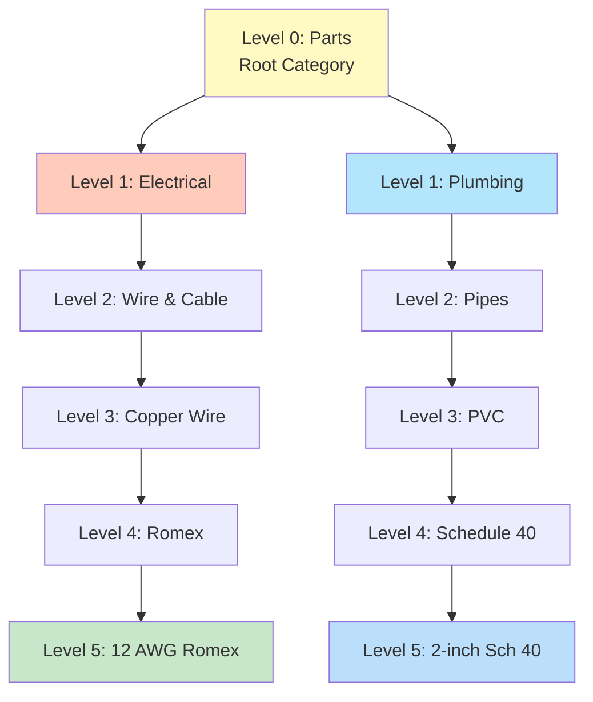
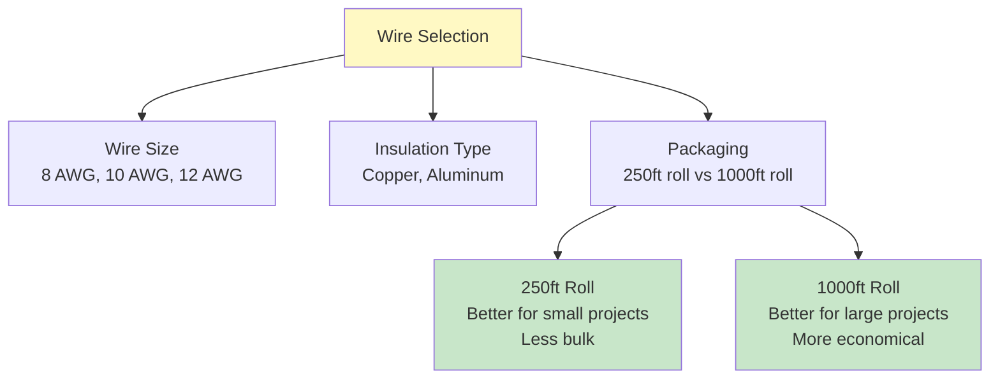
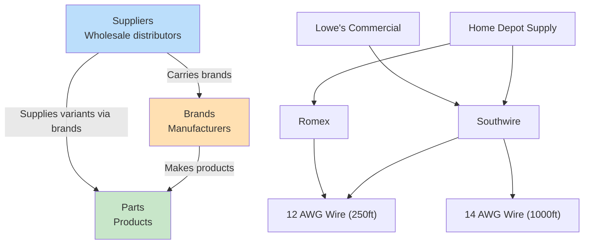
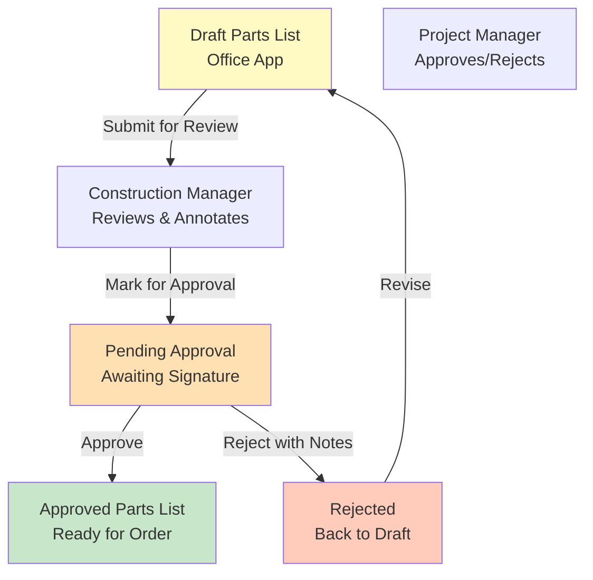
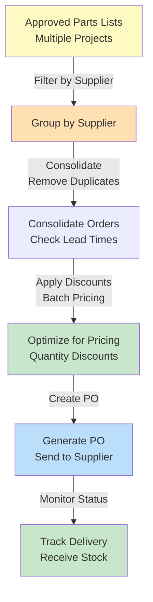
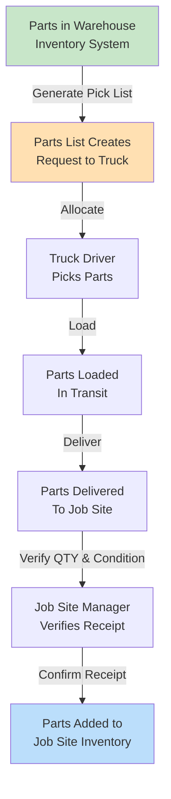

# WeirdToo Parts System – Design Document

## 1. Parts Hierarchy and Classification

### Category Structure (5+ Levels Supported)

**Example: Deep Category Hierarchy**
```
Level 0: Parts (Root)
├─ Level 1: Electrical
│  ├─ Level 2: Wire & Cable
│  │  ├─ Level 3: Copper Wire
│  │  │  ├─ Level 4: Romex
│  │  │  │  └─ Level 5: 12 AWG Romex
│  │  │  └─ Level 4: THHN
│  │  └─ Level 3: Aluminum Wire
│  ├─ Level 2: Outlets & Switches
│  │  ├─ Level 3: Outlets
│  │  │  ├─ Level 4: Single Gang
│  │  │  └─ Level 4: Duplex
│  │  └─ Level 3: Switches
│  └─ Level 2: Panels & Breakers
├─ Level 1: Plumbing
│  ├─ Level 2: Pipes
│  │  ├─ Level 3: PVC
│  │  │  ├─ Level 4: Schedule 40
│  │  │  │  └─ Level 5: 2-inch Schedule 40
│  │  │  └─ Level 4: Schedule 80
│  │  └─ Level 3: Copper
│  ├─ Level 2: Fittings
│  └─ Level 2: Valves
├─ Level 1: Structural
└─ Level 1: Hardware
```



### Category Data Model

```sql
CREATE TABLE PART_CATEGORIES (
    category_id UUID PRIMARY KEY,
    parent_category_id UUID REFERENCES PART_CATEGORIES(category_id),
    name VARCHAR(255) NOT NULL,
    description TEXT,
    category_depth INT NOT NULL,  -- 0 (root) to 5+ (supports unlimited depth)
    full_path VARCHAR(1000),      -- e.g., 'Electrical > Wire & Cable > Copper > Romex > 12 AWG'
    display_order INT,
    is_active BOOLEAN DEFAULT TRUE,
    created_at TIMESTAMP DEFAULT CURRENT_TIMESTAMP,
    modified_at TIMESTAMP DEFAULT CURRENT_TIMESTAMP,
    CONSTRAINT chk_depth CHECK (category_depth >= 0)
);

CREATE INDEX idx_parent_category ON PART_CATEGORIES(parent_category_id);
CREATE INDEX idx_category_depth ON PART_CATEGORIES(category_depth);
CREATE INDEX idx_category_path ON PART_CATEGORIES(full_path);
```

---

## 2. Measurement Units and Variants

### Unit Types Table

| Unit Type | Description | Examples | Quantity Format |
|-----------|-------------|----------|-----------------|
| **Count** | Individual items | Outlets (1, 5, 10), Switches (2, 4, 8) | Whole number |
| **Linear** | Linear measurement | Wire (25ft, 100ft, 250ft), Pipe (10ft, 20ft) | Decimal feet or meters |
| **Roll/Spool** | Rolled material | Wire (250ft roll, 1000ft roll), Tape (60-yard roll) | Count of rolls + internal feet |
| **Custom** | Project-specific | Batch ID, SKU variant, Color variant | String identifier |

### Measurement Unit Schema

```sql
CREATE TABLE MEASUREMENT_UNITS (
    unit_id UUID PRIMARY KEY,
    unit_name VARCHAR(100) NOT NULL UNIQUE,
    unit_type ENUM('COUNT', 'LINEAR', 'ROLL', 'CUSTOM') NOT NULL,
    base_unit VARCHAR(50),  -- 'pieces', 'feet', 'rolls'
    conversion_factor DECIMAL(10, 4),  -- e.g., 12 inches = 1 foot
    is_active BOOLEAN DEFAULT TRUE,
    created_at TIMESTAMP DEFAULT CURRENT_TIMESTAMP
);

-- Examples
INSERT INTO MEASUREMENT_UNITS VALUES
    ('unit-001', 'Individual Count', 'COUNT', 'pieces', 1.0, TRUE, NOW()),
    ('unit-002', 'Linear Feet', 'LINEAR', 'feet', 1.0, TRUE, NOW()),
    ('unit-003', 'Roll (250ft)', 'ROLL', 'feet', 250.0, TRUE, NOW()),
    ('unit-004', 'Roll (1000ft)', 'ROLL', 'feet', 1000.0, TRUE, NOW());
```

---

## 3. Part Variants: Complex Example - Wire

### Wire Variants Decision Tree



### Wire Variants Schema

```sql
CREATE TABLE PARTS (
    part_id UUID PRIMARY KEY,
    category_id UUID REFERENCES PART_CATEGORIES(category_id),
    part_name VARCHAR(255) NOT NULL,
    part_code VARCHAR(50) UNIQUE NOT NULL,
    manufacturer VARCHAR(255),
    base_unit_id UUID REFERENCES MEASUREMENT_UNITS(unit_id),
    description TEXT,
    is_active BOOLEAN DEFAULT TRUE,
    created_at TIMESTAMP DEFAULT CURRENT_TIMESTAMP,
    modified_at TIMESTAMP DEFAULT CURRENT_TIMESTAMP
);

CREATE TABLE PART_VARIANTS (
    variant_id UUID PRIMARY KEY,
    part_id UUID NOT NULL REFERENCES PARTS(part_id),
    variant_name VARCHAR(255) NOT NULL,
    variant_sku VARCHAR(100) UNIQUE NOT NULL,
    variant_unit_id UUID REFERENCES MEASUREMENT_UNITS(unit_id),
    quantity_per_unit INT,  -- For rolls: 250 = 250ft per roll
    specifications JSONB,  -- Example: {"gauge": "12 AWG", "material": "copper"}
    is_primary BOOLEAN DEFAULT FALSE,
    is_active BOOLEAN DEFAULT TRUE,
    created_at TIMESTAMP DEFAULT CURRENT_TIMESTAMP,
    modified_at TIMESTAMP DEFAULT CURRENT_TIMESTAMP
);

-- Example: Wire Part with Variants
INSERT INTO PARTS (part_id, category_id, part_name, part_code, base_unit_id)
VALUES ('part-wire-001', 'cat-electrical-wire', 'Romex Wire 12 AWG', 'WIR-12-ROM', 'unit-002');

INSERT INTO PART_VARIANTS (variant_id, part_id, variant_name, variant_sku, variant_unit_id, quantity_per_unit, specifications)
VALUES 
    ('var-001', 'part-wire-001', '250ft Roll', 'WIR-12-ROM-250', 'unit-003', 250, '{"gauge": "12 AWG", "material": "copper", "type": "Romex"}'),
    ('var-002', 'part-wire-001', '1000ft Roll', 'WIR-12-ROM-1000', 'unit-004', 1000, '{"gauge": "12 AWG", "material": "copper", "type": "Romex"}');

CREATE INDEX idx_part_variants_sku ON PART_VARIANTS(variant_sku);
CREATE INDEX idx_part_variants_part_id ON PART_VARIANTS(part_id);
```

### Variant JSON Example

```json
{
  "variant_id": "var-001",
  "part_id": "part-wire-001",
  "variant_name": "250ft Roll - 12 AWG Copper Romex",
  "variant_sku": "WIR-12-ROM-250",
  "unit_type": "ROLL",
  "quantity_per_unit": 250,
  "specifications": {
    "gauge": "12 AWG",
    "material": "copper",
    "insulation": "THHN/THWN",
    "voltage_rating": "600V",
    "temperature_rating": "90°C",
    "nec_approval": true
  },
  "pricing": {
    "list_price": 89.99,
    "cost_per_foot": 0.36
  },
  "spec_sheet_url": "https://sharepoint/site/wire-specs/WIR-12-ROM-250.pdf"
}
```

---

## 4. Supplier-Brand Relationships

### 3-Way Relationship: Supplier ↔ Brand ↔ Part



### Supplier-Brand-Part Schema

```sql
CREATE TABLE SUPPLIERS (
    supplier_id UUID PRIMARY KEY,
    supplier_name VARCHAR(255) NOT NULL UNIQUE,
    supplier_code VARCHAR(50) UNIQUE NOT NULL,
    contact_email VARCHAR(255),
    contact_phone VARCHAR(20),
    address TEXT,
    city VARCHAR(100),
    state VARCHAR(50),
    zip_code VARCHAR(20),
    country VARCHAR(100),
    payment_terms VARCHAR(100),  -- NET30, NET60, etc.
    lead_time_days INT,
    minimum_order_value DECIMAL(10, 2),
    is_active BOOLEAN DEFAULT TRUE,
    created_at TIMESTAMP DEFAULT CURRENT_TIMESTAMP,
    modified_at TIMESTAMP DEFAULT CURRENT_TIMESTAMP
);

CREATE TABLE BRANDS (
    brand_id UUID PRIMARY KEY,
    brand_name VARCHAR(255) NOT NULL UNIQUE,
    brand_code VARCHAR(50) UNIQUE NOT NULL,
    manufacturer_country VARCHAR(100),
    website URL,
    technical_support_email VARCHAR(255),
    is_active BOOLEAN DEFAULT TRUE,
    created_at TIMESTAMP DEFAULT CURRENT_TIMESTAMP
);

CREATE TABLE SUPPLIER_BRAND_MAPPING (
    mapping_id UUID PRIMARY KEY,
    supplier_id UUID NOT NULL REFERENCES SUPPLIERS(supplier_id),
    brand_id UUID NOT NULL REFERENCES BRANDS(brand_id),
    supplier_brand_code VARCHAR(100),  -- Internal mapping code
    lead_time_days INT,
    minimum_order_qty INT,
    discount_percentage DECIMAL(5, 2),
    contract_expires DATE,
    is_preferred BOOLEAN DEFAULT FALSE,
    created_at TIMESTAMP DEFAULT CURRENT_TIMESTAMP,
    modified_at TIMESTAMP DEFAULT CURRENT_TIMESTAMP,
    UNIQUE(supplier_id, brand_id)
);

CREATE TABLE PART_SUPPLIER_AVAILABILITY (
    availability_id UUID PRIMARY KEY,
    variant_id UUID NOT NULL REFERENCES PART_VARIANTS(variant_id),
    supplier_id UUID NOT NULL REFERENCES SUPPLIERS(supplier_id),
    brand_id UUID NOT NULL REFERENCES BRANDS(brand_id),
    supplier_sku VARCHAR(100),  -- Supplier's own SKU
    list_price DECIMAL(10, 2),
    cost_price DECIMAL(10, 2),
    stock_level INT,
    last_updated TIMESTAMP DEFAULT CURRENT_TIMESTAMP,
    is_current BOOLEAN DEFAULT TRUE,
    UNIQUE(variant_id, supplier_id, brand_id)
);

CREATE INDEX idx_supplier_brand ON SUPPLIER_BRAND_MAPPING(supplier_id, brand_id);
CREATE INDEX idx_part_availability ON PART_SUPPLIER_AVAILABILITY(variant_id);
```

---

## 5. Workflows: From Parts List to Order Execution

### 5.1 Parts List Approval Workflow



### 5.2 Supplier Order Consolidation



### 5.3 Inventory Movement: Warehouse to Job Site



---

## 6. Data Models: Core Entities

### Complete Schema Diagram

```sql
-- Parts Management Core Tables

CREATE TABLE PART_CATEGORIES (
    category_id UUID PRIMARY KEY,
    parent_category_id UUID REFERENCES PART_CATEGORIES(category_id),
    name VARCHAR(255) NOT NULL,
    description TEXT,
    category_depth INT NOT NULL,
    display_order INT,
    is_active BOOLEAN DEFAULT TRUE,
    created_at TIMESTAMP DEFAULT CURRENT_TIMESTAMP,
    modified_at TIMESTAMP DEFAULT CURRENT_TIMESTAMP
);

CREATE TABLE MEASUREMENT_UNITS (
    unit_id UUID PRIMARY KEY,
    unit_name VARCHAR(100) NOT NULL UNIQUE,
    unit_type ENUM('COUNT', 'LINEAR', 'ROLL', 'CUSTOM') NOT NULL,
    base_unit VARCHAR(50),
    conversion_factor DECIMAL(10, 4),
    is_active BOOLEAN DEFAULT TRUE,
    created_at TIMESTAMP DEFAULT CURRENT_TIMESTAMP
);

CREATE TABLE PARTS (
    part_id UUID PRIMARY KEY,
    category_id UUID NOT NULL REFERENCES PART_CATEGORIES(category_id),
    part_name VARCHAR(255) NOT NULL,
    part_code VARCHAR(50) UNIQUE NOT NULL,
    manufacturer VARCHAR(255),
    base_unit_id UUID REFERENCES MEASUREMENT_UNITS(unit_id),
    description TEXT,
    is_active BOOLEAN DEFAULT TRUE,
    created_at TIMESTAMP DEFAULT CURRENT_TIMESTAMP,
    modified_at TIMESTAMP DEFAULT CURRENT_TIMESTAMP
);

CREATE TABLE PART_VARIANTS (
    variant_id UUID PRIMARY KEY,
    part_id UUID NOT NULL REFERENCES PARTS(part_id),
    variant_name VARCHAR(255) NOT NULL,
    variant_sku VARCHAR(100) UNIQUE NOT NULL,
    variant_unit_id UUID REFERENCES MEASUREMENT_UNITS(unit_id),
    quantity_per_unit INT,
    specifications JSONB,
    is_primary BOOLEAN DEFAULT FALSE,
    is_active BOOLEAN DEFAULT TRUE,
    created_at TIMESTAMP DEFAULT CURRENT_TIMESTAMP,
    modified_at TIMESTAMP DEFAULT CURRENT_TIMESTAMP
);

-- Suppliers and Brands

CREATE TABLE SUPPLIERS (
    supplier_id UUID PRIMARY KEY,
    supplier_name VARCHAR(255) NOT NULL UNIQUE,
    supplier_code VARCHAR(50) UNIQUE NOT NULL,
    contact_email VARCHAR(255),
    contact_phone VARCHAR(20),
    address TEXT,
    city VARCHAR(100),
    state VARCHAR(50),
    zip_code VARCHAR(20),
    country VARCHAR(100),
    payment_terms VARCHAR(100),
    lead_time_days INT,
    minimum_order_value DECIMAL(10, 2),
    is_active BOOLEAN DEFAULT TRUE,
    created_at TIMESTAMP DEFAULT CURRENT_TIMESTAMP,
    modified_at TIMESTAMP DEFAULT CURRENT_TIMESTAMP
);

CREATE TABLE BRANDS (
    brand_id UUID PRIMARY KEY,
    brand_name VARCHAR(255) NOT NULL UNIQUE,
    brand_code VARCHAR(50) UNIQUE NOT NULL,
    manufacturer_country VARCHAR(100),
    website VARCHAR(500),
    technical_support_email VARCHAR(255),
    is_active BOOLEAN DEFAULT TRUE,
    created_at TIMESTAMP DEFAULT CURRENT_TIMESTAMP
);

CREATE TABLE SUPPLIER_BRAND_MAPPING (
    mapping_id UUID PRIMARY KEY,
    supplier_id UUID NOT NULL REFERENCES SUPPLIERS(supplier_id),
    brand_id UUID NOT NULL REFERENCES BRANDS(brand_id),
    supplier_brand_code VARCHAR(100),
    lead_time_days INT,
    minimum_order_qty INT,
    discount_percentage DECIMAL(5, 2),
    contract_expires DATE,
    is_preferred BOOLEAN DEFAULT FALSE,
    created_at TIMESTAMP DEFAULT CURRENT_TIMESTAMP,
    modified_at TIMESTAMP DEFAULT CURRENT_TIMESTAMP,
    UNIQUE(supplier_id, brand_id)
);

CREATE TABLE PART_SUPPLIER_AVAILABILITY (
    availability_id UUID PRIMARY KEY,
    variant_id UUID NOT NULL REFERENCES PART_VARIANTS(variant_id),
    supplier_id UUID NOT NULL REFERENCES SUPPLIERS(supplier_id),
    brand_id UUID NOT NULL REFERENCES BRANDS(brand_id),
    supplier_sku VARCHAR(100),
    list_price DECIMAL(10, 2),
    cost_price DECIMAL(10, 2),
    stock_level INT,
    last_updated TIMESTAMP DEFAULT CURRENT_TIMESTAMP,
    is_current BOOLEAN DEFAULT TRUE,
    UNIQUE(variant_id, supplier_id, brand_id)
);

-- Inventory Tracking

CREATE TABLE WAREHOUSE_INVENTORY (
    inventory_id UUID PRIMARY KEY,
    warehouse_id UUID NOT NULL,
    variant_id UUID NOT NULL REFERENCES PART_VARIANTS(variant_id),
    quantity_on_hand INT,
    quantity_reserved INT,
    quantity_available INT,
    location_zone VARCHAR(50),
    location_bin VARCHAR(50),
    last_stock_check TIMESTAMP,
    created_at TIMESTAMP DEFAULT CURRENT_TIMESTAMP,
    modified_at TIMESTAMP DEFAULT CURRENT_TIMESTAMP,
    UNIQUE(warehouse_id, variant_id)
);

CREATE TABLE TRUCK_INVENTORY (
    inventory_id UUID PRIMARY KEY,
    truck_id UUID NOT NULL,
    variant_id UUID NOT NULL REFERENCES PART_VARIANTS(variant_id),
    quantity_on_truck INT,
    storage_location VARCHAR(100),
    last_verified TIMESTAMP,
    created_at TIMESTAMP DEFAULT CURRENT_TIMESTAMP,
    modified_at TIMESTAMP DEFAULT CURRENT_TIMESTAMP,
    UNIQUE(truck_id, variant_id)
);

-- Audit and Tracking

CREATE TABLE PART_AUDIT_LOG (
    audit_id UUID PRIMARY KEY,
    variant_id UUID NOT NULL REFERENCES PART_VARIANTS(variant_id),
    action VARCHAR(50),  -- 'created', 'updated', 'price_changed'
    changed_by_user VARCHAR(255),
    changed_at TIMESTAMP DEFAULT CURRENT_TIMESTAMP,
    old_values JSONB,
    new_values JSONB,
    request_file_id VARCHAR(255)  -- Links to cloud storage request
);

CREATE INDEX idx_part_audit_variant ON PART_AUDIT_LOG(variant_id);
CREATE INDEX idx_part_audit_timestamp ON PART_AUDIT_LOG(changed_at);
```

---

## 7. UI/UX Design: Construction Worker Focus

### 7.1 Parts List Editor (Office App)

```
┌─────────────────────────────────────────────────────────┐
│ Parts List: Residential Renovation - Unit 204           │
├─────────────────────────────────────────────────────────┤
│ Project: Unit 204 Renovation  │ Status: [Draft    ▼]    │
│ Manager: John Smith           │ Date: 2025-05-15        │
├─────────────────────────────────────────────────────────┤
│                                                           │
│ ┌─ ELECTRICAL ─────────────────────────────────────────┐ │
│ │ Part           │ Variant        │ Qty  │ Unit   │ Action
│ ├───────────────────────────────────────────────────────┤
│ │ Romex Wire 12A │ 250ft Roll     │ 2    │ Rolls  │ [⋮]
│ │ Outlets        │ Single Gang    │ 8    │ Count  │ [⋮]
│ │ Switches       │ 3-Way          │ 4    │ Count  │ [⋮]
│ └───────────────────────────────────────────────────────┘
│
│ ┌─ PLUMBING ──────────────────────────────────────────┐ │
│ │ Part           │ Variant        │ Qty  │ Unit   │ Action
│ ├───────────────────────────────────────────────────────┤
│ │ PVC Pipe 2"    │ 10ft Section   │ 5    │ Pieces │ [⋮]
│ │ Copper Fitting │ 90° Elbow      │ 12   │ Count  │ [⋮]
│ │ Valves         │ Ball Valve 1"  │ 3    │ Count  │ [⋮]
│ └───────────────────────────────────────────────────────┘
│
│ Subtotal: 34 items                                       │
│ [+ Add Part]  [View Spec Sheets]  [Submit for Review]   │
└─────────────────────────────────────────────────────────┘
```

### 7.2 Truck Inventory (Truck App)

```
┌─────────────────────────────────────────────────────────┐
│ Truck Inventory - Truck #5                              │
├─────────────────────────────────────────────────────────┤
│ Driver: Tom Johnson  │ Route: Route A  │ Status: [On Route]
├─────────────────────────────────────────────────────────┤
│
│ CURRENT INVENTORY:
│ ┌─────────────────────────────────────────────────────┐
│ │ ELECTRICAL (Section A-1)                            │
│ │ ✓ Romex Wire 12A (250ft)     : 2 rolls in stock    │
│ │ ✓ Outlets (Single Gang)      : 8 pieces in stock   │
│ │ ✓ Switches (3-Way)           : 4 pieces in stock   │
│ └─────────────────────────────────────────────────────┘
│
│ ┌─────────────────────────────────────────────────────┐
│ │ PLUMBING (Section B-2)                              │
│ │ ✓ PVC Pipe 2" (10ft)         : 5 pieces in stock   │
│ │ ! Copper Fittings            : 8 of 12 used        │
│ │ ✓ Valves (Ball 1")           : 3 pieces in stock   │
│ └─────────────────────────────────────────────────────┘
│
│ [View Spec Sheet]  [Mark as Delivered]  [Report Damage] │
└─────────────────────────────────────────────────────────┘
```

### 7.3 Warehouse Stock View

```
┌──────────────────────────────────────────────────────────┐
│ Warehouse Inventory Management                           │
├──────────────────────────────────────────────────────────┤
│ Search: [Wire____________] [Category ▼] [Low Stock ▼]   │
├──────────────────────────────────────────────────────────┤
│
│ Part                    │ SKU        │ On Hand │ Reserved
├─────────────────────────────────────────────────────────┤
│ Romex Wire 12A (250ft)  │ WIR-12-250 │ 24      │ 4
│ Romex Wire 12A (1000ft) │ WIR-12-1K  │ 8       │ 2
│ Romex Wire 10A (250ft)  │ WIR-10-250 │ 12      │ 0
│ Copper Wire (250ft)     │ COP-250    │ 5       │ 2
│
│ [Generate Pick List]  [Restock Order]  [Audit Count] [Export]
└──────────────────────────────────────────────────────────┘
```

---

## 8. AI Integration: Autogen Agents

### 8.1 PartsSpecialist Agent

**Responsibility**: Identify correct part variant based on construction requirements

```python
parts_specialist = {
    "name": "PartsSpecialist",
    "system_message": """You are an expert in construction parts selection.
    Help construction teams find the right part variants based on specifications.
    Consider gauge, material, voltage rating, temperature rating, and NEC codes.
    For wire: 12 AWG for lighting, 10 AWG for larger circuits.
    Recommend 250ft rolls for small projects, 1000ft for large.""",
    "functions": [
        "search_part_variants",
        "get_part_specifications",
        "get_supplier_availability",
        "compare_variants",
        "get_spec_sheets"
    ]
}
```

### 8.2 SupplierMatcher Agent

**Responsibility**: Find best supplier/brand combination for parts list

```python
supplier_matcher = {
    "name": "SupplierMatcher",
    "system_message": """You are an expert in supplier sourcing and procurement.
    Analyze parts lists and recommend the best suppliers based on:
    - Price competitiveness
    - Lead time (must meet project deadlines)
    - Brand reliability
    - Supplier payment terms
    - Bulk discounts for consolidation
    Group parts by supplier to minimize shipping costs.""",
    "functions": [
        "get_supplier_brands",
        "get_availability_pricing",
        "calculate_lead_times",
        "apply_bulk_discounts",
        "consolidate_orders",
        "compare_supplier_options"
    ]
}
```

### 8.3 OrderGenerator Agent

**Responsibility**: Create and track purchase orders

```python
order_generator = {
    "name": "OrderGenerator",
    "system_message": """You are a procurement specialist.
    Create, validate, and track purchase orders for parts.
    Ensure orders meet minimum quantity thresholds.
    Track delivery status and alert on delays.
    Manage supplier communications.""",
    "functions": [
        "create_purchase_order",
        "validate_order_completeness",
        "submit_to_supplier",
        "track_delivery_status",
        "receive_and_verify_stock",
        "process_returns_credits"
    ]
}
```

---

## 9. Spec Sheet Management

### Spec Sheet Storage and Access

**Location**: Cloud storage (SharePoint/Google Drive)
**Organization**: `/SpecSheets/{Category}/{Brand}/{PartSKU}.pdf`

Example structure:
```
/SpecSheets/
  /Electrical/
    /Southwire/
      /WIR-12-250.pdf
      /WIR-12-1000.pdf
    /Romex/
      /ROM-12-250.pdf
  /Plumbing/
    /Copper/
      /FITT-90EL.pdf
```

### Accessing Spec Sheets from Apps

**JSON Request** (Truck App to Cloud):
```json
{
  "request_type": "get_spec_sheet",
  "request_id": "req-spec-001",
  "timestamp": "2025-05-15T14:30:00Z",
  "variant_sku": "WIR-12-ROM-250",
  "device_id": "truck-005"
}
```

**Response** (Server writes to Cloud):
```json
{
  "request_id": "req-spec-001",
  "status": "success",
  "spec_sheet_url": "https://sharepoint.com/sites/parts/SpecSheets/Electrical/Southwire/WIR-12-250.pdf",
  "file_path": "/SpecSheets/Electrical/Southwire/WIR-12-250.pdf",
  "timestamp": "2025-05-15T14:30:45Z"
}
```

---

## 10. Design Principles Summary

1. **Parts Complexity**: Full support for categories, measurement units, variants, and hierarchical relationships
2. **Supplier Integration**: 3-way many-to-many relationships (Supplier ↔ Brand ↔ Part)
3. **Construction Worker Focus**: Easy-to-read UI, quick access to spec sheets, clear inventory visibility
4. **Cloud-Mediated Only**: All inter-device communication through cloud storage JSON files
5. **Offline Capable**: Local caching on SQLite so apps work without cloud connectivity
6. **Auditable**: All changes tracked through cloud request files with modification history

---

## 11. UI Theme – Retro CRT (Black + Green)

- **Base palette**: `#000000` background, primary text `#00FF66`, secondary text `#66FFB2`, accent `#00CC55`, error/alert `#FF5555`, selection/focus `#0A7F4F`.
- **Typography**: Monospace everywhere (e.g., JetBrains Mono / Cascadia Code / SF Mono); bold weights for headings, normal for body; avoid serifs.
- **Contrast & accessibility**: Maintain WCAG AA by keeping text `#00FF66` on `#000000`; for disabled states use `#1F3A2C` and `#4CAF50` outlines; ensure focus ring `#00FF66` 2px outside elements.
- **Components**: Flat, no gradients; rectangular buttons with slight rounding (2-4px); hover = brighten text to `#66FFB2`; active = invert text/background (`#000000` text on `#00FF66` fill).
- **Input fields**: Black fill, `#00FF66` borders, caret `#66FFB2`, placeholder `#339966`; error border `#FF5555` with minimal red text.
- **Tables & lists**: Row hover `#0A0F0A`, zebra optional with `#050A05`; grid lines `#0F2A1A`.
- **Charts/visuals**: Bars/lines `#00FF66` primary, `#66FFB2` secondary; backgrounds remain black; avoid pastels.
- **Motion**: Minimal animations; if any, use 150–200ms fades; no parallax or heavy easing to keep “old terminal” feel.
- **Assets**: Use simple vector icons in single-color `#00FF66`; avoid multicolor glyphs.
- **Theming note**: This retro theme is default across mobile and desktop views. Keep dark surfaces pure black to preserve the CRT aesthetic.
