# WeirdToo Parts System – Workflow Diagrams

## 1. Parts List Creation and Approval Workflow

### 1.1 Three-Stage Approval Process


### 1.2 Parts List State Machine


---

## 2. Supplier Order Consolidation Workflow

### 2.1 Consolidation Process (AI-Driven)


### 2.2 Consolidation Example: Two Projects, One Supplier

```
PROJECT A - Parts List:
├── Wire 12AWG (250ft roll)  x2
├── Outlets (Single Gang)     x8
└── Switches (3-Way)          x4

PROJECT B - Parts List:
├── Wire 12AWG (250ft roll)  x1
├── Wire 10AWG (250ft roll)  x2
└── Outlets (Single Gang)     x4

CONSOLIDATION BY SUPPLIER (Home Depot Supply):
├── Wire 12AWG (250ft roll)  x3  ← Combined: 2+1
├── Wire 10AWG (250ft roll)  x2
├── Outlets (Single Gang)     x12 ← Combined: 8+4
└── Switches (3-Way)          x4

BULK DISCOUNT APPLIED:
├── > 10 items: 5% discount applied
├── Total Cost: $450 (before discount)
└── Final Cost: $427.50 (after 5% discount)
```

---

## 3. Inventory Movement: Warehouse to Job Site

### 3.1 Complete Inventory Movement Workflow


### 3.2 Truck Inventory Consumption at Job Site


---

## 4. Wire Selection Workflow: Construction Worker Perspective

### 4.1 Wire Selection Decision Tree


---

## 5. Wire Roll Variant Decision Logic

### 5.1 Wire Roll Selection: Cost-Benefit Analysis


---

## 6. AI Task Processing Workflow

### 6.1 Master Queue and Dependency Chain


### 6.2 Task Execution with Error Handling


---

## 7. Device Cloud Sync Sequence Diagram

### 7.1 Request/Response File Watching Cycle


### 7.2 Multi-Step Request with Dependencies


---

## 8. Return and Credit Processing Workflow

### 8.1 Return Request to Supplier


---

## 9. System-Wide Swimlane: Complete Parts-to-Delivery Flow

```mermaid
graph TD
    A["📋 OFFICE PHASE"]
    B["Manager: Create Parts List"]
    C["Office App → Cloud"]
    D["Submit for Review"]
    E["Manager: Review & Annotate"]
    F["Approve"]
    
    G["🤖 AI PHASE"]
    H["SupplierMatcher Analyzes"]
    I["Finds Best Suppliers"]
    J["Calculates Bulk Discounts"]
    
    K["📦 PROCUREMENT PHASE"]
    L["OrderGenerator Creates POs"]
    M["Submit to Suppliers"]
    N["Suppliers Confirm"]
    O["Set Delivery Date"]
    
    P["🏭 WAREHOUSE PHASE"]
    Q["Receive Stock"]
    R["Add to Warehouse Inventory"]
    S["Job Site Requests Items"]
    T["Pick and Pack"]
    U["Load onto Truck"]
    
    V["🚚 DELIVERY PHASE"]
    W["Truck in Transit"]
    X["Arrive at Job Site"]
    Y["Unload Parts"]
    
    Z["🏗️ JOB SITE PHASE"]
    AA["Manager Verifies Delivery"]
    AB["Parts Added to Job Inventory"]
    AC["Workers Use Parts"]
    AD["Track Consumption"]
    
    A --> B
    B --> C
    C --> D
    D --> E
    E --> F
    F --> G
    G --> H
    H --> I
    I --> J
    J --> K
    K --> L
    L --> M
    M --> N
    N --> O
    O --> P
    P --> Q
    Q --> R
    R --> S
    S --> T
    T --> U
    U --> V
    V --> W
    W --> X
    X --> Y
    Y --> Z
    Z --> AA
    AA --> AB
    AB --> AC
    AC --> AD
    
    style A fill:#f8bbd0
    style G fill:#e1f5ff
    style K fill:#ffe0b2
    style P fill:#c8e6c9
    style V fill:#bbdefb
    style Z fill:#f8bbd0
```



---

## 10. User Request Approval Workflow

### 10.1 RequestRouter AI Decision Flow


### 10.2 Tree Hierarchy Approval Routing

**Scenario: Supervisor Edits Same-Level User in Different Branch**


### 10.3 Exception-Based Approval Bypass

**Scenario: Worker with Special Exception**


### 10.4 Cost-Based Approval Escalation

**Scenario: Request Exceeds Role's Approval Threshold**


### 10.5 Multi-Stage Approval Workflow

**Complex Request Requiring Multiple Approvals**


### 10.6 Approval Timeout & Auto-Escalation

**Handling Delayed Approvals**


---

## 11. Error Handling and Escalation Workflow

### 10.1 Common Error Scenarios


---

## 11. Offline Workflow: No Cloud Connectivity

### 11.1 Device Operating Without Cloud Access

```mermaid
graph TD
    A["Network Connection Lost"]
    B["Device Operating<br/>in Offline Mode"]
    C["SQLite Cache<br/>Has Data"]
    D["User: View Parts List"]
    E["Load from<br/>Local Cache"]
    F["Display Last<br/>Synced Data"]
    G["User: Create<br/>Offline Note"]
    H["Store Locally<br/>in Cache"]
    I["Connection Restored"]
    J["Sync Queue Processes"]
    K["Send All Pending<br/>Requests"]
    L["Receive Responses"]
    M["Update Cache<br/>with Results"]
    N["Notify User<br/>Sync Complete"]
    
    A --> B
    B --> C
    C --> D
    D --> E
    E --> F
    F --> G
    G --> H
    H --> I
    I --> J
    J --> K
    K --> L
    L --> M
    M --> N
    
    style B fill:#fff9c4
    style F fill:#bbdefb
    style N fill:#c8e6c9
```

---

## 12. Glossary: Workflow Terms

| Term | Definition |
|------|-----------|
| **Parts List** | Collection of parts needed for a specific project, submitted for approval |
| **Variant** | Specific configuration of a part (e.g., 250ft vs 1000ft wire roll) |
| **SKU** | Stock Keeping Unit; unique identifier for a variant |
| **Lead Time** | Days from order to delivery from supplier |
| **Consolidation** | Combining multiple parts lists into fewer orders for bulk pricing |
| **RMA** | Return Merchandise Authorization; reference number for returning items |
| **Bulk Discount** | Percentage discount applied when ordering quantities above threshold |
| **Spec Sheet** | PDF documentation of part specifications and certifications |
| **Device Sync** | Process of device writing request to cloud and polling for response |
| **Cloud Storage** | SharePoint or Google Drive used as inter-app message broker |
| **Offline Mode** | Device operating without cloud connectivity, using local cache |
| **AI Agent** | Autonomous subprocess (PartsSpecialist, SupplierMatcher, OrderGenerator) |
| **Task Dependency** | Condition that one task must complete before another can start |
| **Poll** | Device/Server repeatedly checking cloud folder for new files |
| **Request/Response** | JSON file pair: device writes request, server writes response |
