# C4 Container Diagram - CloudWatcher System

## Overview
This diagram illustrates the major software containers (applications, services, databases) within the CloudWatcher system and how they interact with external systems and users.

## Container Architecture Diagram

```mermaid
    C4Container
    title Container Diagram for CloudWatcher System - Real-time Cloud File Sync

    %% External Systems & Actors
    Person(device_user, "Mobile Device User", "Operates mobile app on iOS/Android device to submit requests")
    Person(cloud_admin, "Cloud Admin", "Monitors and manages cloud storage accounts")
    System_Ext(sharepoint, "SharePoint/OneDrive", "Primary cloud storage for files and documents")
    System_Ext(googledrive, "Google Drive", "Secondary cloud storage backup")
    System_Ext(llm_service, "LLM Services", "OpenAI, Claude, or other AI model providers")

    %% CloudWatcher System Boundary
    Container_Boundary(cloudwatcher, "CloudWatcher System") {
        
        %% Mobile Client
        Container(mobile_app, "Mobile Application", "Swift/Kotlin, SQLite", "Offline-capable mobile app for iOS/Android that submits file processing requests and receives responses")
        
        %% Web Services
        Container_Boundary(web_services, "ASP.NET Core API") {
            Container(request_api, "Request API", "C#, ASP.NET Core 9.0", "Handles incoming device requests, validates, serializes, and uploads to cloud storage")
            Container(response_api, "Response API", "C#, ASP.NET Core 9.0", "Manages response delivery from cloud storage back to mobile devices")
            Container(websocket_hub, "WebSocket Hub", "SignalR, C#", "Real-time bidirectional communication with connected mobile devices")
            Container(request_handler, "Request Handler Service", "C#, Async/Await", "Orchestrates request processing: validation, serialization, retry logic, cloud upload")
            Container(scheduler_service, "Scheduler Service", "C#, Hangfire/Quartz", "Periodic cloud synchronization, database cleanup, offline sync")
        }
        
        %% Cloud Storage Integration
        Container_Boundary(cloud_integration, "Cloud Storage Layer") {
            Container(storage_provider, "Multi-Provider Storage Adapter", "C#, Strategy Pattern", "Abstracts multiple cloud providers (SharePoint, Google Drive, Local)")
            Container(file_sync_engine, "File Sync Engine", "C#, File Watcher", "Monitors cloud storage for changes, triggers processing pipelines")
        }
        
        %% AI Processing Layer
        Container_Boundary(ai_processing, "AI & Orchestration") {
            Container(agent_orchestrator, "Agent Orchestrator", "Python, Microsoft AutoGen", "Multi-agent AI framework for intelligent request routing and processing")
            Container(agent_pool, "Agent Pool", "Python, Async Workers", "Individual specialized agents (text analysis, categorization, validation, response generation)")
        }
        
        %% Data Layer
        Container_Boundary(data_layer, "Data & Caching") {
            ContainerDb(postgres_db, "PostgreSQL Database", "PostgreSQL 15+, Relational Schema", "Persistent storage: device data, requests, responses, metadata, audit logs")
            Container(redis_cache, "Redis Cache Cluster", "Redis Cluster, 3+ nodes", "Distributed caching: request cache, response cache, session state, rate limiting counters")
            Container(local_db, "SQLite Cache", "SQLite, Mobile Device", "Local mobile device database for offline request queueing")
        }
    }

    %% Relationships - External
    Rel(device_user, mobile_app, "Uses", "Mobile App on Device")
    Rel(mobile_app, request_api, "Submits Request", "JSON/HTTPS")
    Rel(mobile_app, websocket_hub, "Receives Updates", "WebSocket")
    Rel(mobile_app, local_db, "Queues Offline", "SQLite API")

    Rel(cloud_admin, sharepoint, "Manages")
    Rel(cloud_admin, googledrive, "Manages")

    %% Relationships - Within Web Services
    Rel(request_api, request_handler, "Delegates Processing")
    Rel(response_api, request_handler, "Retrieves Response")
    Rel(websocket_hub, response_api, "Notifies Connected Clients")
    Rel(request_handler, storage_provider, "Uploads/Downloads Files")
    Rel(scheduler_service, file_sync_engine, "Triggers Sync Cycle")

    %% Relationships - Storage Layer
    Rel(storage_provider, sharepoint, "Reads/Writes Files", "Microsoft Graph API")
    Rel(storage_provider, googledrive, "Reads/Writes Files", "Google Drive API")
    Rel(file_sync_engine, storage_provider, "Monitors Changes")

    %% Relationships - AI Processing
    Rel(request_handler, agent_orchestrator, "Routes Request", "JSON/REST")
    Rel(agent_orchestrator, agent_pool, "Distributes Work", "Message Queue")
    Rel(agent_orchestrator, llm_service, "Calls LLM API", "OpenAI/Claude API")

    %% Relationships - Data Layer
    Rel(request_handler, postgres_db, "Reads/Writes Request", "JDBC/Async")
    Rel(response_api, postgres_db, "Reads/Writes Response", "JDBC/Async")
    Rel(scheduler_service, postgres_db, "Reads/Cleans Up", "JDBC")
    Rel(request_handler, redis_cache, "Caches Request", "Redis Protocol")
    Rel(response_api, redis_cache, "Caches Response", "Redis Protocol")
    Rel(agent_orchestrator, postgres_db, "Logs Execution", "JDBC")
    Rel(mobile_app, local_db, "Syncs Queued Requests", "Background")

    %% Relationships - Bidirectional
    BiRel(websocket_hub, postgres_db, "Session/State Management")
    BiRel(file_sync_engine, postgres_db, "Sync Status Tracking")

    %% Styling
    UpdateElementStyle(mobile_app, $bgColor="90EE90")
    UpdateElementStyle(request_api, $bgColor="87CEEB")
    UpdateElementStyle(response_api, $bgColor="87CEEB")
    UpdateElementStyle(websocket_hub, $bgColor="87CEEB")
    UpdateElementStyle(request_handler, $bgColor="FFD700")
    UpdateElementStyle(scheduler_service, $bgColor="FFD700")
    UpdateElementStyle(storage_provider, $bgColor="DDA0DD")
    UpdateElementStyle(file_sync_engine, $bgColor="DDA0DD")
    UpdateElementStyle(agent_orchestrator, $bgColor="FF6347")
    UpdateElementStyle(agent_pool, $bgColor="FF6347")
    UpdateElementStyle(postgres_db, $bgColor="696969")
    UpdateElementStyle(redis_cache, $bgColor="DC143C")
    UpdateElementStyle(local_db, $bgColor="90EE90")

    UpdateLayoutConfig($c4ShapeInRow="4", $c4BoundaryInRow="2")
```

## Container Descriptions

### Mobile & Client Layer (Green)
- **Mobile Application**: iOS/Android app with offline-first architecture, SQLite queue, WebSocket listener
  - Submits requests via HTTPS
  - Receives real-time updates via WebSocket
  - Queues offline requests locally
  - Syncs when network available

### API Services Layer (Blue)
- **Request API**: REST endpoint for submitting device requests (POST, GET, DELETE, LIST)
  - Validates incoming JSON payloads
  - Delegates processing to Request Handler
  - Returns 202 Accepted for async operations
  
- **Response API**: REST endpoint for delivering processed responses
  - Retrieves responses from PostgreSQL
  - Delivers via HTTP or WebSocket
  - Supports response metadata queries

- **WebSocket Hub** (SignalR): Real-time bidirectional communication
  - Maintains persistent connections to mobile devices
  - Broadcasts response delivery notifications
  - Handles connection heartbeat/keepalive
  - Manages session affinity for horizontal scaling

### Orchestration Layer (Gold)
- **Request Handler Service**: Core async orchestrator
  - Serializes requests to JSON
  - Uploads to cloud storage (SharePoint/Google Drive)
  - Implements exponential backoff retry (3 max)
  - Routes to AI Agent Orchestrator for processing
  - Caches results in Redis

- **Scheduler Service**: Periodic maintenance
  - Runs on configurable interval (e.g., every 5 minutes)
  - Syncs offline mobile requests (batch upload)
  - Cleans up expired cache entries
  - Triggers cloud storage consistency checks
  - Uses Hangfire for job scheduling and persistence

### Cloud Integration Layer (Purple)
- **Storage Provider Adapter**: Multi-provider abstraction
  - Implements Strategy pattern for provider selection
  - SharePoint: Primary storage (Microsoft Graph API)
  - Google Drive: Secondary backup (Google Drive API)
  - Local filesystem: Development/fallback mode
  - Transparent provider failover on errors

- **File Sync Engine**: Continuous cloud monitoring
  - Watches cloud storage for file changes
  - Triggers processing pipeline on new files
  - Tracks sync status in PostgreSQL
  - Implements distributed file change detection

### AI & Processing Layer (Red)
- **Agent Orchestrator** (Python): Multi-agent coordination
  - Receives routed requests from Request Handler
  - Manages agent pool allocation and work distribution
  - Calls external LLM services (OpenAI, Claude)
  - Handles agent failure recovery
  - Logs execution trace to PostgreSQL

- **Agent Pool**: Specialized worker agents
  - Text Analysis Agent: Content extraction, NLP
  - Categorization Agent: Request classification
  - Validation Agent: Schema and constraint checking
  - Response Generation Agent: Formatted output creation
  - Custom Task Agents: Domain-specific processing

### Data & Caching Layer (Gray/Red)
- **PostgreSQL Database**: Primary persistent storage
  - Device registration and profiles
  - Request history with metadata (status, timestamps, AI decisions)
  - Response storage and delivery tracking
  - Cloud sync status and error logs
  - Audit trail and compliance data
  - Connection pooling (pgBouncer or built-in)

- **Redis Cache Cluster**: Distributed in-memory cache
  - Request deduplication cache (5-minute TTL)
  - Response cache for repeated queries (30-minute TTL)
  - Session state for WebSocket connections
  - Rate limiting counters per device
  - Distributed lock coordination (RedLock pattern)
  - Cluster mode with auto-failover

- **SQLite Local Database**: Mobile device cache
  - Offline request queue (FIFO)
  - Local response cache
  - Sync status metadata
  - Available for sync on network reconnection

## Technology Stack Summary

| Layer | Components | Tech Stack |
|-------|-----------|-----------|
| Mobile | Mobile App | Swift/Kotlin, SQLite |
| API | Request/Response/WebSocket | ASP.NET Core 9.0, C#, SignalR |
| Orchestration | Request Handler, Scheduler | C#, Async/Await, Hangfire |
| Storage | Provider Adapter, Sync Engine | C#, Strategy Pattern, File Watcher |
| AI | Orchestrator, Agent Pool | Python, Microsoft AutoGen, Async |
| Database | PostgreSQL | PostgreSQL 15+, Relational |
| Cache | Redis Cluster | Redis 7.0+, Cluster Mode |
| Cloud | SharePoint, Google Drive | Microsoft Graph API, Google Drive API |
| LLM | External Services | OpenAI API, Anthropic API, etc. |

## Communication Patterns

1. **Mobile → API**: Synchronous HTTPS (Request-Response)
2. **Mobile ↔ WebSocket Hub**: Bidirectional WebSocket (Real-time updates)
3. **API → Cloud Storage**: Asynchronous via Request Handler (Upload/Download)
4. **Request Handler → Agent Orchestrator**: Synchronous REST or Queue-based
5. **Agent Orchestrator → LLM Service**: Synchronous HTTP (with timeout)
6. **Scheduler Service → Cloud Storage**: Periodic batch sync
7. **All Services → PostgreSQL**: Async connection pooling
8. **All Services → Redis**: Async cluster communication

## Deployment Considerations

- **Web Services**: Horizontally scalable, stateless (except session affinity for WebSocket)
- **Agent Orchestrator**: Separate Python worker pool, can scale independently
- **PostgreSQL**: Primary-replica setup with read replicas for scaling
- **Redis**: Cluster mode (3+ nodes) for fault tolerance
- **Mobile App**: Client-side local SQLite for offline-first design
- **Cloud Storage**: Multi-provider for reliability (failover logic in adapter)

