# C4 Component Diagram - API Application Layer

## Overview
This diagram shows the internal component structure of the ASP.NET Core API Application, demonstrating the responsibility of each component and how they interact.

## Component Architecture Diagram

```mermaid
    C4Component
    title Component Diagram for CloudWatcher - ASP.NET Core API Application

    %% External Systems
    Container(mobile_app, "Mobile Application", "Swift/Kotlin, SQLite", "Offline-capable client for device request submission")
    Container(cloud_storage, "Cloud Storage", "SharePoint/Google Drive", "External cloud providers")
    Container(agent_orchestrator, "Agent Orchestrator", "Python, AutoGen", "AI processing orchestration")
    ContainerDb(postgres, "PostgreSQL Database", "PostgreSQL 15+", "Persistent storage")
    Container(redis, "Redis Cache", "Redis Cluster", "Distributed caching")

    %% API Application Components
    Container_Boundary(api, "ASP.NET Core API Application") {
        
        %% Controllers - HTTP Entry Points
        Component(request_controller, "RequestController", "ASP.NET Core MVC", "HTTP endpoints: POST/GET/DELETE/LIST for device requests")
        Component(response_controller, "ResponseController", "ASP.NET Core MVC", "HTTP endpoints: POST/GET/DELETE/LIST for responses")
        Component(status_controller, "StatusController", "ASP.NET Core MVC", "HTTP endpoints: Health check, system status")
        
        %% Request Processing
        Component(request_handler, "RequestHandler", "C#, Async Service", "Orchestrates request processing: validation, serialization, cloud upload, retry logic")
        Component(request_validator, "RequestValidator", "C#, Fluent Validation", "Validates incoming request schemas and constraints")
        Component(request_serializer, "RequestSerializer", "C# JSON", "Serializes requests to JSON, handles circular references")
        
        %% Response Management
        Component(response_manager, "ResponseManager", "C#, Service", "Retrieves responses from cloud, formats for delivery")
        Component(response_formatter, "ResponseFormatter", "C#, JSON/Protocol", "Formats response payload based on client requirements")
        
        %% WebSocket/Real-time
        Component(websocket_hub, "SignalR WebSocket Hub", "SignalR, C#", "Manages WebSocket connections and broadcasts")
        Component(connection_manager, "ConnectionManager", "C#, Service", "Tracks active device connections, session affinity")
        Component(notification_service, "NotificationService", "C#, Service", "Queues and delivers real-time notifications to clients")
        
        %% Cloud Integration
        Component(storage_adapter, "ICloudStorageProvider", "C#, Strategy Pattern", "Abstract interface for multi-provider cloud storage")
        Component(sharepoint_provider, "SharePointProvider", "C#, Microsoft Graph SDK", "SharePoint/OneDrive cloud storage implementation")
        Component(googledrive_provider, "GoogleDriveProvider", "C#, Google API SDK", "Google Drive cloud storage implementation")
        Component(local_provider, "LocalFileProvider", "C#, System.IO", "Local filesystem provider for development/fallback")
        
        %% Orchestration & Scheduling
        Component(orchestrator_client, "OrchestratorClient", "C#, HTTP Client", "Routes requests to Python Agent Orchestrator")
        Component(scheduler, "BackgroundScheduler", "C#, Hangfire", "Manages periodic tasks: sync, cleanup, maintenance")
        Component(sync_coordinator, "SyncCoordinator", "C#, Service", "Coordinates offline sync, batch uploads from mobile")
        
        %% Data & Caching
        Component(cache_service, "CacheService", "C#, StackExchange.Redis", "Abstraction over Redis for caching operations")
        Component(db_context, "CloudWatcherDbContext", "C#, Entity Framework", "Data access abstraction over PostgreSQL")
        Component(cache_invalidator, "CacheInvalidator", "C#, Service", "Manages cache invalidation on data changes")
        
        %% Cross-Cutting Concerns
        Component(auth_middleware, "AuthenticationMiddleware", "ASP.NET Core Middleware", "OAuth2/JWT token validation")
        Component(error_handler, "GlobalErrorHandler", "ASP.NET Core Middleware", "Centralized exception handling and error responses")
        Component(rate_limiter, "RateLimiter", "ASP.NET Core Middleware", "Per-device rate limiting using Redis counters")
        Component(logging_service, "LoggingService", "C#, Serilog", "Structured logging with correlation IDs")
    }

    %% Relationships - Controllers to Services
    Rel(request_controller, request_handler, "Delegates Processing")
    Rel(request_controller, request_validator, "Validates Payload")
    Rel(response_controller, response_manager, "Fetches Response")
    Rel(status_controller, connection_manager, "Queries Connection Status")

    %% Relationships - Request Processing
    Rel(request_handler, request_serializer, "Serializes Request")
    Rel(request_handler, storage_adapter, "Uploads to Cloud")
    Rel(request_handler, orchestrator_client, "Routes to AI")
    Rel(request_handler, cache_service, "Caches Request")
    Rel(request_handler, db_context, "Stores Metadata")
    Rel(request_serializer, request_validator, "Pre-validates Format")

    %% Relationships - Response Management
    Rel(response_manager, response_formatter, "Formats Response")
    Rel(response_manager, db_context, "Retrieves from DB")
    Rel(response_manager, cache_service, "Checks Cache")
    Rel(response_controller, notification_service, "Triggers Notification")

    %% Relationships - WebSocket/Real-time
    Rel(websocket_hub, connection_manager, "Tracks Connections")
    Rel(websocket_hub, notification_service, "Broadcasts Messages")
    Rel(notification_service, response_manager, "Gets Response Data")
    Rel(connection_manager, cache_service, "Stores Session State")

    %% Relationships - Cloud Integration
    Rel(request_handler, storage_adapter, "Uploads")
    Rel(response_manager, storage_adapter, "Downloads")
    Rel(storage_adapter, sharepoint_provider, "SharePoint Operations")
    Rel(storage_adapter, googledrive_provider, "Google Drive Operations")
    Rel(storage_adapter, local_provider, "Fallback/Development")
    Rel(sharepoint_provider, cloud_storage, "Microsoft Graph API")
    Rel(googledrive_provider, cloud_storage, "Google Drive API")

    %% Relationships - Orchestration & Scheduling
    Rel(request_handler, orchestrator_client, "Routes for AI Processing")
    Rel(orchestrator_client, agent_orchestrator, "JSON/REST API")
    Rel(scheduler, sync_coordinator, "Triggers Sync Cycles")
    Rel(sync_coordinator, db_context, "Reads Pending Syncs")
    Rel(sync_coordinator, storage_adapter, "Uploads Offline Queue")

    %% Relationships - Data & Caching
    Rel(request_handler, db_context, "Reads/Writes")
    Rel(response_manager, db_context, "Reads")
    Rel(request_handler, cache_service, "Caches Results")
    Rel(response_manager, cache_service, "Cache Lookup")
    Rel(cache_invalidator, cache_service, "Invalidates Entries")
    Rel(db_context, postgres, "SQL Operations")
    Rel(cache_service, redis, "Redis Operations")

    %% Relationships - Middleware
    Rel(request_controller, auth_middleware, "Validates Token")
    Rel(request_controller, rate_limiter, "Enforces Limit")
    Rel(request_controller, error_handler, "Error Handling")
    Rel(request_handler, logging_service, "Logs Operations")
    Rel(response_manager, logging_service, "Logs Operations")
    Rel(rate_limiter, cache_service, "Reads Counters")

    %% Bidirectional Relationships
    BiRel(request_handler, cache_invalidator, "Invalidate on Create")
    BiRel(db_context, cache_invalidator, "Update Triggers")

    %% Styling
    UpdateElementStyle(request_controller, $bgColor="87CEEB")
    UpdateElementStyle(response_controller, $bgColor="87CEEB")
    UpdateElementStyle(status_controller, $bgColor="87CEEB")
    UpdateElementStyle(request_handler, $bgColor="FFD700")
    UpdateElementStyle(response_manager, $bgColor="FFD700")
    UpdateElementStyle(websocket_hub, $bgColor="FF69B4")
    UpdateElementStyle(storage_adapter, $bgColor="DDA0DD")
    UpdateElementStyle(sharepoint_provider, $bgColor="DDA0DD")
    UpdateElementStyle(googledrive_provider, $bgColor="DDA0DD")
    UpdateElementStyle(local_provider, $bgColor="DDA0DD")
    UpdateElementStyle(orchestrator_client, $bgColor="FF6347")
    UpdateElementStyle(db_context, $bgColor="696969")
    UpdateElementStyle(cache_service, $bgColor="DC143C")
    UpdateElementStyle(auth_middleware, $bgColor="FFA500")

    UpdateLayoutConfig($c4ShapeInRow="5", $c4BoundaryInRow="1")
```



## Component Responsibilities

### HTTP Controllers (API Entry Points - Blue)
- **RequestController**: Routes and validates incoming request submissions
  - Accepts POST requests from mobile app
  - Delegates to RequestHandler for processing
  - Returns 202 Accepted for asynchronous processing
  
- **ResponseController**: Manages response retrieval and delivery
  - Retrieves processed responses by requestId
  - Delivers via HTTP or WebSocket
  - Supports response filtering and metadata queries

- **StatusController**: Provides system health and connection status
  - Health check endpoint (readiness/liveness)
  - Connected device count
  - Cache statistics
  - Pending queue depth

### Request Processing (Gold)
- **RequestHandler**: Core orchestration service
  - Validates request payload
  - Serializes to cloud-compatible format
  - Routes to Agent Orchestrator for processing
  - Implements exponential backoff retry logic
  - Caches results in Redis

- **RequestValidator**: Fluent Validation rules
  - JSON schema validation
  - Required field checks
  - File size constraints
  - Device ID format validation

- **RequestSerializer**: JSON serialization
  - Converts request objects to cloud-friendly JSON
  - Handles circular reference detection
  - Preserves metadata (timestamp, source)

### Response Management (Gold)
- **ResponseManager**: Retrieves and formats responses
  - Fetches from PostgreSQL or Redis cache
  - Handles response expiration
  - Formats for specific client requirements

- **ResponseFormatter**: Response payload transformation
  - Converts internal format to client format
  - Handles protocol-specific serialization
  - Includes metadata (status, timestamps)

### WebSocket/Real-time (Pink)
- **SignalR WebSocket Hub**: Manages WebSocket connections
  - Accepts persistent connections
  - Routes broadcast messages
  - Manages connection groups by device

- **ConnectionManager**: Session tracking
  - Maintains active connection registry
  - Implements session affinity for stateful operations
  - Tracks device health via heartbeat

- **NotificationService**: Real-time notifications
  - Queues response delivery notifications
  - Broadcasts to connected clients
  - Retries on delivery failure

### Cloud Storage Integration (Purple)
- **ICloudStorageProvider**: Strategy pattern interface
  - Defines contract for all cloud providers
  - Enables provider-agnostic code
  - Supports transparent failover

- **SharePointProvider**: Microsoft Graph API implementation
  - Uploads/downloads files from SharePoint
  - Uses OAuth2 for authentication
  - Handles folder structure creation

- **GoogleDriveProvider**: Google Drive API implementation
  - Uploads/downloads via Google Drive API
  - Manages quota and storage limits
  - Handles file versioning

- **LocalFileProvider**: Filesystem fallback
  - Development and testing provider
  - Fallback for network failures
  - Simple file system operations

### Orchestration & Scheduling (Red)
- **OrchestratorClient**: AI routing client
  - Sends requests to Python Agent Orchestrator
  - Receives processing results
  - Implements timeout and retry logic

- **BackgroundScheduler**: Hangfire job orchestration
  - Schedules periodic sync jobs
  - Manages job history and status
  - Distributes work across instances

- **SyncCoordinator**: Offline sync management
  - Processes offline request queues from mobile
  - Batches uploads for efficiency
  - Tracks sync progress

### Data & Caching (Gray/Red)
- **CloudWatcherDbContext**: Entity Framework Core
  - Data model definition
  - Connection pooling
  - Transaction management

- **CacheService**: Redis abstraction
  - Set/Get operations with TTL
  - Atomic increment for counters
  - List operations for queues

- **CacheInvalidator**: Cache coherence
  - Invalidates on CRUD operations
  - Propagates cache invalidation
  - Implements cache warming patterns

### Cross-Cutting Concerns (Orange)
- **AuthenticationMiddleware**: Security
  - OAuth2 token validation
  - JWT claims extraction
  - Device ID verification

- **GlobalErrorHandler**: Error handling
  - Catches unhandled exceptions
  - Maps to HTTP status codes
  - Logs with correlation ID

- **RateLimiter**: Quota enforcement
  - Per-device request limiting
  - Token bucket algorithm
  - Redis-backed counters

- **LoggingService**: Structured logging
  - Serilog with correlation IDs
  - Contextual information capture
  - Distributed tracing support

## Data Flow Examples

### Request Submission Flow
1. Mobile app → RequestController (POST /api/request)
2. RequestController → RequestValidator (validate schema)
3. RequestController → RequestHandler (process)
4. RequestHandler → RequestSerializer (serialize)
5. RequestHandler → ICloudStorageProvider (upload)
6. RequestHandler → OrchestratorClient (route for AI)
7. RequestHandler → CacheService (cache request)
8. RequestHandler → CloudWatcherDbContext (store metadata)
9. ResponseController returns 202 Accepted

### Response Delivery Flow
1. Agent Orchestrator completes processing → NotificationService
2. NotificationService → ResponseManager (fetch response)
3. ResponseManager → CloudWatcherDbContext (query response)
4. ResponseManager → ResponseFormatter (format payload)
5. NotificationService → SignalR WebSocket Hub (broadcast)
6. WebSocket Hub → ConnectionManager (lookup connected clients)
7. WebSocket Hub → Mobile app (deliver via WebSocket)

### Cache Invalidation Flow
1. RequestHandler stores result in CacheService
2. Response delivery → CacheInvalidator (notify update)
3. CacheInvalidator → CacheService (invalidate old entries)
4. CacheService → Redis (delete key)
5. Next query fetches fresh data from PostgreSQL

## Dependency Injection Pattern

All components registered in ASP.NET Core DI container:

```csharp
// In Program.cs
services.AddTransient<IRequestValidator, RequestValidator>();
services.AddScoped<ICloudStorageProvider, StorageProviderFactory>();
services.AddSingleton<ICacheService, CacheService>();
services.AddScoped<IRequestHandler, RequestHandler>();
// ... etc
```

## Testing Strategy

- **Controllers**: Unit tests with mock dependencies (IRequestHandler, ILogger)
- **Services**: Integration tests with in-memory database
- **Providers**: Mock cloud storage with file system stubs
- **Middleware**: Pipeline tests with TestServer
- **End-to-end**: Full request/response cycles with real PostgreSQL and Redis

