# C4 Deployment Diagram - CloudWatcher Production Architecture

## Overview
This diagram shows the production deployment topology for CloudWatcher, including physical/virtual nodes, containers, and how components are distributed across infrastructure.

## Deployment Architecture Diagram

```mermaid
    C4Deployment
    title Deployment Diagram for CloudWatcher System - Production Infrastructure

    %% Development Environment
    Deployment_Node(dev_machine, "Developer Machine", "Windows/macOS/Linux") {
        Deployment_Node(dev_ide, "Visual Studio / VS Code", "IDE") {
            Container(dev_api, "ASP.NET Core API", "localhost:5001")
        }
        Deployment_Node(dev_local_db, "SQLite", "Local Database") {
            ContainerDb(dev_sqlite, "Local Dev DB", "SQLite")
        }
        Deployment_Node(dev_local_cache, "In-Memory Cache", "Local") {
            Container(dev_cache, "MemoryCache", "In-Process")
        }
        Deployment_Node(dev_local_storage, "Local File System", "File Storage") {
            Container(dev_files, "Local Folder", "Cloud Simulation")
        }
    }

    %% Cloud Provider Infrastructure (Production)
    Deployment_Node(cloud_region, "Azure/AWS Cloud Region", "us-east-1") {
        
        %% Kubernetes Cluster for API Services
        Deployment_Node(k8s_cluster, "Kubernetes Cluster", "AKS/EKS") {
            
            %% Load Balancer
            Deployment_Node(lb_node, "Load Balancer Node", "Azure LB / AWS ALB") {
                Container(api_lb, "API Load Balancer", "Layer 7, HTTPS")
            }
            
            %% API Service Replicas
            Deployment_Node(api_pod_1, "API Pod 1", "Kubernetes Pod") {
                Container(api_instance_1, "CloudWatcher API v1", "ASP.NET Core 9.0")
            }
            Deployment_Node(api_pod_2, "API Pod 2", "Kubernetes Pod") {
                Container(api_instance_2, "CloudWatcher API v2", "ASP.NET Core 9.0")
            }
            Deployment_Node(api_pod_3, "API Pod 3", "Kubernetes Pod") {
                Container(api_instance_3, "CloudWatcher API v3", "ASP.NET Core 9.0")
            }
            
            %% Scheduler Deployment (Single Instance with High Availability)
            Deployment_Node(scheduler_pod, "Scheduler Pod", "Kubernetes Pod") {
                Container(scheduler_instance, "Hangfire Scheduler", "ASP.NET Core Background Service")
            }
            
            %% SignalR Scaling
            Deployment_Node(signalr_node, "SignalR Backplane", "Kubernetes Pod") {
                Container(signalr_container, "SignalR Service", "ASP.NET Core SignalR Hub")
            }
        }
        
        %% Data Layer
        Deployment_Node(data_layer_node, "Data Layer", "Managed Services") {
            
            %% PostgreSQL Database
            Deployment_Node(postgres_node, "PostgreSQL Managed Instance", "Azure Database for PostgreSQL / RDS") {
                Deployment_Node(postgres_primary, "Primary (Write)", "PostgreSQL 15") {
                    ContainerDb(postgres_primary_db, "CloudWatcher DB", "Primary Replica")
                }
                Deployment_Node(postgres_replica_1, "Read Replica 1", "PostgreSQL 15") {
                    ContainerDb(postgres_read_1, "CloudWatcher DB", "Read-Only Replica")
                }
                Deployment_Node(postgres_replica_2, "Read Replica 2", "PostgreSQL 15") {
                    ContainerDb(postgres_read_2, "CloudWatcher DB", "Read-Only Replica")
                }
            }
            
            %% Redis Cache Cluster
            Deployment_Node(redis_cluster, "Redis Cache Cluster", "Azure Cache for Redis / ElastiCache") {
                Deployment_Node(redis_node_1, "Redis Node 1", "Redis 7.0+") {
                    Container(redis_instance_1, "Redis", "Shard 1")
                }
                Deployment_Node(redis_node_2, "Redis Node 2", "Redis 7.0+") {
                    Container(redis_instance_2, "Redis", "Shard 2")
                }
                Deployment_Node(redis_node_3, "Redis Node 3", "Redis 7.0+") {
                    Container(redis_instance_3, "Redis", "Shard 3")
                }
            }
        }
        
        %% Cloud Storage Integration
        Deployment_Node(cloud_storage_node, "Cloud Storage Layer", "Multi-Cloud") {
            Container(sharepoint_gateway, "SharePoint Gateway", "Microsoft Graph API Wrapper")
            Container(googledrive_gateway, "Google Drive Gateway", "Google Drive API Wrapper")
            Container(storage_cache, "Storage Cache", "CDN / Edge Cache")
        }
        
        %% Message Queue / Event Bus
        Deployment_Node(message_queue, "Message Queue", "Azure Service Bus / AWS SQS") {
            Container(request_queue, "Request Queue", "FIFO Queue")
            Container(notification_queue, "Notification Queue", "Pub-Sub Topic")
        }
        
        %% Logging & Monitoring
        Deployment_Node(observability, "Observability Stack", "Managed Services") {
            Container(log_aggregator, "Log Aggregator", "Azure Log Analytics / ELK")
            Container(metrics_store, "Metrics Store", "Prometheus / CloudWatch")
            Container(distributed_trace, "Distributed Tracing", "Application Insights / Jaeger")
        }
    }
    
    %% Separate AI/ML Infrastructure (Python Services)
    Deployment_Node(ml_region, "Separate Cloud Region", "us-west-2 (Optional)") {
        Deployment_Node(ml_cluster, "Python Worker Cluster", "Kubernetes / VM Scale Set") {
            Deployment_Node(ml_pod_1, "Agent Pod 1", "Kubernetes Pod") {
                Container(agent_1, "Agent Orchestrator", "Python, AutoGen Framework")
            }
            Deployment_Node(ml_pod_2, "Agent Pod 2", "Kubernetes Pod") {
                Container(agent_2, "Agent Orchestrator", "Python, AutoGen Framework")
            }
            Deployment_Node(ml_pod_3, "Agent Pod 3", "Kubernetes Pod") {
                Container(agent_3, "Agent Orchestrator", "Python, AutoGen Framework")
            }
        }
        
        Deployment_Node(ml_cache, "Agent Cache Layer", "Managed Services") {
            Container(agent_redis, "Agent Redis", "Redis for shared state")
        }
        
        Deployment_Node(ml_storage, "Agent Storage", "Blob Storage") {
            Container(agent_models, "LLM Model Cache", "ONNX Models, Embeddings")
        }
    }
    
    %% External Services
    Deployment_Node(external_services, "External Services", "Third-Party SaaS") {
        Container(llm_api, "LLM API Services", "OpenAI, Anthropic, etc.")
        Container(sharepoint_cloud, "SharePoint Online", "Microsoft 365")
        Container(googledrive_cloud, "Google Drive", "Google Cloud")
        Container(monitoring_cloud, "Monitoring SaaS", "Datadog, New Relic")
    }
    
    %% Mobile Clients
    Deployment_Node(mobile_clients, "Mobile Devices", "User Endpoint") {
        Deployment_Node(ios_device, "iOS Device", "iPhone/iPad") {
            Container(ios_app, "CloudWatcher iOS App", "Swift, SwiftUI")
        }
        Deployment_Node(android_device, "Android Device", "Smartphone/Tablet") {
            Container(android_app, "CloudWatcher Android App", "Kotlin, Jetpack Compose")
        }
    }

    %% Internal Network Relationships
    Rel(api_lb, api_instance_1, "Routes Traffic", "HTTPS Port 443")
    Rel(api_lb, api_instance_2, "Routes Traffic", "HTTPS Port 443")
    Rel(api_lb, api_instance_3, "Routes Traffic", "HTTPS Port 443")
    
    Rel(api_instance_1, postgres_primary_db, "Read/Write", "TCP Port 5432")
    Rel(api_instance_2, postgres_primary_db, "Read/Write", "TCP Port 5432")
    Rel(api_instance_3, postgres_primary_db, "Read/Write", "TCP Port 5432")
    
    Rel(api_instance_1, postgres_read_1, "Read-Only", "TCP Port 5432")
    Rel(api_instance_2, postgres_read_2, "Read-Only", "TCP Port 5432")
    
    Rel(api_instance_1, redis_instance_1, "Cache", "Redis Cluster")
    Rel(api_instance_2, redis_instance_2, "Cache", "Redis Cluster")
    Rel(api_instance_3, redis_instance_3, "Cache", "Redis Cluster")
    
    Rel(scheduler_instance, postgres_primary_db, "Scheduled Tasks", "TCP Port 5432")
    Rel(scheduler_instance, request_queue, "Publishes", "Service Bus")
    
    Rel(signalr_container, notification_queue, "Subscribes", "Pub-Sub")
    Rel(signalr_container, redis_instance_1, "Session State", "Redis")
    
    Rel(api_instance_1, sharepoint_gateway, "Upload/Download", "HTTPS")
    Rel(api_instance_2, googledrive_gateway, "Upload/Download", "HTTPS")
    Rel(sharepoint_gateway, sharepoint_cloud, "Microsoft Graph API", "HTTPS")
    Rel(googledrive_gateway, googledrive_cloud, "Google Drive API", "HTTPS")
    
    Rel(api_instance_1, agent_1, "Route Request", "HTTP/gRPC")
    Rel(api_instance_2, agent_2, "Route Request", "HTTP/gRPC")
    Rel(api_instance_3, agent_3, "Route Request", "HTTP/gRPC")
    
    Rel(agent_1, llm_api, "Inference", "HTTPS API")
    Rel(agent_2, llm_api, "Inference", "HTTPS API")
    Rel(agent_1, agent_redis, "Shared State", "Redis")
    Rel(agent_2, agent_models, "Model Cache", "Blob Storage")
    
    %% External Communication
    Rel(ios_app, api_lb, "Submit Request / Receive Updates", "HTTPS + WebSocket")
    Rel(android_app, api_lb, "Submit Request / Receive Updates", "HTTPS + WebSocket")
    
    Rel(api_instance_1, log_aggregator, "Stream Logs", "HTTP Collector")
    Rel(api_instance_2, metrics_store, "Push Metrics", "Prometheus scrape")
    Rel(scheduler_instance, distributed_trace, "Trace Correlation", "OpenTelemetry")
    
    %% Styling by Layer
    UpdateElementStyle(api_lb, $bgColor="FF6347")
    UpdateElementStyle(api_instance_1, $bgColor="87CEEB")
    UpdateElementStyle(api_instance_2, $bgColor="87CEEB")
    UpdateElementStyle(api_instance_3, $bgColor="87CEEB")
    UpdateElementStyle(scheduler_instance, $bgColor="FFD700")
    UpdateElementStyle(signalr_container, $bgColor="FF69B4")
    UpdateElementStyle(postgres_primary_db, $bgColor="696969")
    UpdateElementStyle(postgres_read_1, $bgColor="808080")
    UpdateElementStyle(postgres_read_2, $bgColor="808080")
    UpdateElementStyle(redis_instance_1, $bgColor="DC143C")
    UpdateElementStyle(redis_instance_2, $bgColor="DC143C")
    UpdateElementStyle(redis_instance_3, $bgColor="DC143C")
    UpdateElementStyle(sharepoint_gateway, $bgColor="DDA0DD")
    UpdateElementStyle(googledrive_gateway, $bgColor="DDA0DD")
    UpdateElementStyle(agent_1, $bgColor="FF6347")
    UpdateElementStyle(agent_2, $bgColor="FF6347")
    UpdateElementStyle(agent_3, $bgColor="FF6347")
    UpdateElementStyle(ios_app, $bgColor="90EE90")
    UpdateElementStyle(android_app, $bgColor="90EE90")
```

## Deployment Topology Details

### Development Environment
- **Single machine** with all components running locally
- SQLite for database (no network latency)
- In-memory cache (no Redis setup needed)
- Local file system as cloud simulation
- Enables rapid debugging and testing

### Production Environment - K8s Cluster

#### Load Balancer (Red)
- **Azure Load Balancer** or **AWS Application Load Balancer**
- Terminates HTTPS (TLS 1.3)
- Routes traffic to healthy API pods
- Health checks every 5 seconds
- Sticky sessions for WebSocket affinity

#### API Service Replicas (Blue)
- **3+ API pod replicas** for high availability
- ASP.NET Core 9.0 running in Docker containers
- Kubernetes auto-scaling based on CPU/memory
- Rolling updates with zero downtime
- Pod disruption budgets (PDB) for safety
- Resource limits: 2 CPU, 2GB memory per pod

#### Scheduler (Gold)
- **Single instance with leader election** for distributed scheduling
- Hangfire for reliable job persistence
- Ensures only one instance runs scheduled tasks
- Can scale for parallel job execution
- PostgreSQL-backed job queue

#### SignalR Hub (Pink)
- **Managed SignalR service** or **in-cluster pods**
- Horizontal scaling with Redis backplane
- Session affinity maintained via sticky sessions
- Persistent connections (one per mobile device)
- Message batching for throughput

### Data Layer

#### PostgreSQL (Gray)
- **Primary-Replica topology** with 2+ read replicas
- **Managed service** (Azure Database, RDS, or Cloud SQL)
- **Automatic backups** (daily, point-in-time recovery)
- **Connection pooling** via pgBouncer (100+ connections)
- **High availability** with automatic failover
- Replication lag < 1 second (synchronous mode)
- **Partition by device_id** for future sharding

#### Redis Cluster (Red)
- **3-node cluster minimum** for fault tolerance
- **Cluster mode enabled** for horizontal scaling
- **Persistence**: RDB snapshots + AOF logs
- **Automatic failover** with sentinel monitoring
- **Key expiration** policies (Request: 5 min, Response: 30 min)
- **Memory limit policies**: evict LRU on capacity

### Cloud Storage Layer (Purple)
- **Multi-provider gateway pattern**
- SharePoint Provider: Uses Microsoft Graph API
- Google Drive Provider: Uses Google Drive API
- Automatic provider failover on network errors
- CDN/Edge caching for frequently accessed files
- Rate limit handling per provider

### Message Queue
- **Azure Service Bus** or **AWS SQS + SNS**
- Separate queues for requests and notifications
- Pub-Sub topic for real-time broadcasts
- Dead-letter handling for failed messages
- Retention: 14+ days for audit trail

### AI/ML Infrastructure (Optional Secondary Region)
- **Kubernetes cluster in separate region** (us-west-2)
- Python AutoGen framework for multi-agent orchestration
- **3+ agent orchestrator replicas** for scaling
- Separate Redis for agent state sharing
- Blob storage for LLM model caching
- Can be deployed across regions for latency optimization

### Observability Stack
- **Logs**: Azure Log Analytics or ELK Stack
- **Metrics**: Prometheus or CloudWatch
- **Traces**: Application Insights or Jaeger
- **APM**: Distributed tracing with correlation IDs
- **Dashboards**: Real-time monitoring (Grafana/Azure Monitor)
- **Alerts**: PagerDuty integration for oncall

### External Services
- **LLM APIs**: OpenAI, Anthropic, or custom models
- **Cloud Providers**: SharePoint Online, Google Drive
- **Monitoring SaaS**: Datadog, New Relic (optional)

### Mobile Clients
- **iOS App** (Swift, SwiftUI): Uses native networking stack
- **Android App** (Kotlin, Jetpack Compose): Uses native networking
- Both support offline-first with SQLite local queue
- Background sync on network reconnection

## Network Communication

### Secure Communication (HTTPS/TLS 1.3)
- Mobile app → Load Balancer: HTTPS (port 443)
- API ↔ PostgreSQL: TLS encrypted
- API ↔ Redis: TLS in Redis Cluster mode
- API ↔ Cloud storage: HTTPS with OAuth2

### Real-time Communication (WebSocket)
- Mobile app ↔ SignalR Hub: WebSocket (port 443 via HTTPS upgrade)
- Session affinity via sticky cookies
- Backplane via Redis Pub-Sub
- Heartbeat every 30 seconds

### Inter-service Communication
- API → Agent Orchestrator: HTTP/gRPC (internal network)
- Agent → LLM APIs: HTTPS with API keys
- Scheduler → Message Queue: Internal service bus

## Scaling Strategies

### Horizontal Scaling
1. **API Replicas**: Auto-scale 3-10 pods based on CPU > 70%
2. **Agent Orchestrator**: Scale 3-20 pods based on queue depth
3. **PostgreSQL**: Add read replicas, implement sharding
4. **Redis**: Cluster mode with slot distribution
5. **Storage**: CDN for file distribution

### Vertical Scaling
1. **Database**: Increase instance size (more CPU/RAM)
2. **Cache**: Upgrade to larger Redis nodes
3. **API Pods**: Increase memory limit (for large request processing)

### Geographic Scaling
1. **Multi-region deployment**: Replicate entire stack
2. **Global load balancer**: Route by latency
3. **Database replication**: Cross-region backups
4. **AI/ML: Deploy agents closer to users

## Disaster Recovery

### Backup Strategy
- **Database**: Daily backups (7-day retention minimum)
- **Configuration**: IaC (Infrastructure as Code) in git
- **Secrets**: Managed in Azure Key Vault or AWS Secrets Manager

### Recovery Objectives
- **RTO** (Recovery Time Objective): < 15 minutes
- **RPO** (Recovery Point Objective): < 5 minutes
- **Failover**: Automated to secondary region

### High Availability
- **Zero downtime deployments**: Rolling updates
- **PDB policies**: Minimum 2 replicas always available
- **Service mesh** (optional): Istio for advanced routing

## Security Considerations

1. **Network Security**:
   - Private subnets for databases
   - VPC/VNet isolation
   - WAF (Web Application Firewall) rules

2. **Data Security**:
   - Encryption at rest (TDE for PostgreSQL, Transparent Encryption for Redis)
   - Encryption in transit (TLS 1.3)
   - Field-level encryption for sensitive data

3. **Access Control**:
   - OAuth2 / OpenID Connect for mobile auth
   - Service-to-service: API keys / managed identities
   - RBAC for cloud admin access

4. **Secrets Management**:
   - Azure Key Vault / AWS Secrets Manager
   - Automatic rotation (90-day intervals)
   - Audit logging for access

## Cost Optimization

1. **Resource Management**:
   - Auto-scaling down during off-peak hours
   - Reserved instances for base load
   - Spot instances for batch jobs

2. **Data Storage**:
   - Archival of old requests (6+ months) to cold storage
   - Database index optimization
   - Compression for cloud storage

3. **Network**:
   - Private endpoints (reduce data egress costs)
   - Cache to reduce database queries
   - CDN for static content

